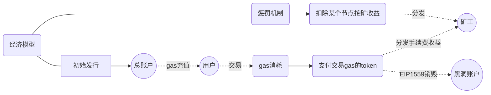

# 1.链底层需求点

## 经济模型
- token名：`Peculiar`
- token代号：`PEC`
- 预发行: `2^200`（约）
- 所有上链交易都需消耗`gas`，以`PEC`支付
- 验证节点有分红(交易手续费)，以`PEC`支付, 有锁仓机制

经济模型:

## 黑白名机制

前期

- 矿工的收益不能提取。
- 普通账户之间不能相互转账。
- 租户账户才可以创建合约 ?

后期
- 支持把以上2个开关打开。

--------------------------------

# 2.区块浏览器

需要有自己的区块浏览器，第一版不需要太多功能，有就行。

# 3.SDK

稀台可以通过sdk和链底层进行对接，实现NFT相关功能。

# 4.NFT合约模板功能

提供标准的ERC721、ERC1155合约模板
