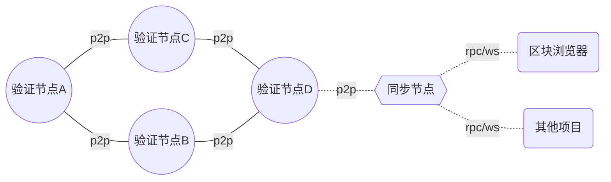

# 1.主网服务器成本

节点类型定义：

- 验证节点：参与共识和链治理，不直接对外提供节点服务
- 同步节点：不参与共识和链治理，直接对外提供节点服务（RPC、WS）

## 主网验证节点服务器成本

以主网`4`个节点计算，采用以下配置

- `16 cores CPU`
- `32G RAM`
- `500G SSD` IOPS 大于5万, (前期500G够了，后续再扩展)
- `10M` 带宽

以阿里云为例，按照阿里云华南区（深圳）的价格，`4`台服务器`1年`的费用是 `126911`元。

## 主网同步节点服务器成本

TODO待定

- `16 cores CPU`
- `32G RAM`
- `500G SSD` IOPS 大于5万, (前期500G够了，后续再扩展)
- `10M` 带宽

以阿里云为例，按照阿里云华南区（深圳）的价格，1台服务器1年的费用为 `31727`元

## 主网区块浏览器服务器成本

> https://docs.blockscout.com/for-projects/resource-requirements

- 16 core, 32 thread
- 128GB RAM
- 10M 带宽
- 数据库 500G SSD  IOPS 大于5万, (前期500G够了，后续再扩展)

以阿里云为例，按照阿里云华南区（深圳）的价格，1台服务器1年的费用为 `37928`元

# 2.测试网服务器成本
## (测试网)节点服务器成本

以主网4个节点计算，采用以下配置

- `8 cores CPU`
- `16G RAM`
- `250G SSD` IOPS 大于5万, (前期250G够了，后续再扩展)
- `3M` 带宽

以阿里云为例，按照阿里云华南区（深圳）的价格，4台服务器`1年`的费用是 `41851`元。

## 测试网同步节点服务器成本

测试网，可以不用同步节点

## 测试网区块浏览器服务器成本

- `8 core`
- `32GB RAM`
- 数据库 500G SSD  IOPS 大于5万, (前期500G够了，后续再扩展)

以阿里云为例，按照阿里云华南区（深圳）的价格，4台服务器`1年`的费用是 `20906`元

