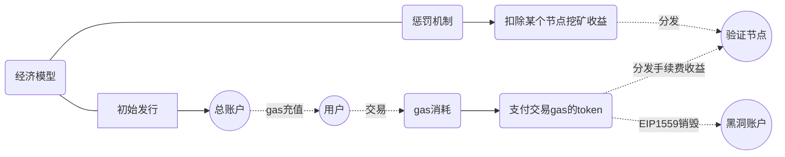

# 奇异链

## 1.需求概述

- **经济模型**：有Token、激励机制、惩罚机制、销毁机制、有gas销毁机制、支持通胀或通缩；
- **共识机制**：尽量不要分叉，共识协议应该是`PoS`、`DPoS`、`PoA`类似的协议，不能是`PoW` ；
- **性能**：性能必须能满足国内NFT市场需要，竞品蚂蚁链TPS在`100`左右，奇异链的目标TPS: `150+`
- **兼容EVM**：必须兼容EVM、支持solidity，同时需要有技术生态
- **可扩展性**：随着业务的发展，对于链底层需求会持续变化，需要有良好的可扩展性（跨链、Layer2）
- **账户管理**：为了适应国内政策监管，链上账户的权限必须可控（黑白名单机制）

## 2.技术选型

公链生态：
  - 以太坊生态（Ethereum）：
    - "公链之王"
    - 生态完善
  - Cosmos生态：
    - Cosmos-SDK 模块化、跨链、可升级、可扩展性强 
    - Golang语言开发
  - 波卡生态(Pokadot)：
    - Subtrate框架使用Rust语言开发
  - 其他生态：
    - Solana: Rust语言开发、性能高，但是不稳定
    - 其他

联盟链生态：
  - FISCO BCOS ： 国内基于FISCO BCOS的落地应用虽多，但是底层太杂乱、太臃肿，可塑性不好；
  - Chainmaker（长安链): 项目研发中，模块丰富，但是，可塑性不好，尚不稳定，且暂不支持激励机制；
  - Irita (基于Cosmos SDK)：基于Cosmos-SDK开发，技术成熟且稳定，模块化的架构，可塑性强，文昌链基于Irita开发，兼容EVM。但是，技术生态（如应用SDK）不如以太坊。
  - 其他

**最终选型：以太坊生态**

TODO, 增加一个图

## 3.经济模型

Token初始总量约为：`2^200`，后续可根据实际业务进行销毁。

经济模型:

## 4.共识机制

- 综合`POA`和`POS`，形成`PoSA`共识，底层使用`PoA`进行共识，激励层使用`PoS`;
- 绝大多数情况下都不会形成分叉（异常情况，也可以进行恢复）;
- 支持外部项目方**申请**成为我们的验证节点，参与链治理，获得gas分红;

## 5.性能
> 注意：TPS主要是用NFT智能合约交易的交易来衡量，而不是普通转账交易。考虑到奇异链的应用场景，主要是NFT应用。
- 链的TPS（每秒交易量） = 平均区块包含的交易量 ÷ 平均出块时间
- 奇异链的目标TPS: `150+`，高于蚂蚁链
- 实施方案：
  - 平均出块时间: 降低到`3s`, 以太坊的出块是`13.3s`，
  - 平均区块包含的交易量: 提高区块的gas限制`blockGasLimit`，默认为 `4800万`~`5000万`

- 理论TPS：
  - 单个mint（NFT铸造）交易需要消耗的最大gas：`80000`（实际一笔mint在4~5万左右）
  - 极限TPS（保守）：`208 = 50000000 / 80000 / 3`
  - 单日交易量：`17971200 = 208 * 3600 * 24`

- 实际测试TPS：
  - 实测TPS： `330+` ， 是蚂蚁链的`3`倍
  - 单日交易量：`28512000 = 330 * 24 * 3600`

## 6.完全兼容EVM

- 使用以太坊生态，天然支持EVM
- 对于熟悉以太坊智能合约开发的开发者，0学习成本
- 以及智能合约开发的生态，包括但不限于Web3.js、Web3j、Metamask、RemixIDE等等等
- 复用以太坊生态的成熟方案，如Openzeppelin

> 蚂蚁链为了控制智能合约资源使用过多，它的EVM是阉割版的，如：不支持合约中创建合约和递归调用

## 7.可扩展性

- 硬分叉：我们可以通过硬分叉来升级系统合约、增加更多底层功能，实现上层业务需求；
- layer2扩容：通过增加侧链实现扩容，如为不同的场景构建单独的侧链，提高链的吞吐性；
- 跨链：可以通过"中继链+预言机"的方案实现跨链
  - 国内其他联盟链上的资产(NFT)跨链到奇异链
  - 奇异链上的资产跨链到其他链（公链、联盟链）

## 8.账户管理

- Token：token仅用于支付gas消耗、激励验证节点参与链的治理和运行，禁止token的交易和炒作
- 账户可控：
  - 账户权限控制，将账户分类为B端、C端;
  - B端账户拥有创建合约和普通转账权限;
  - C端账户拥有调用合约权限，但不能发起普通转账交易;
  - 增加黑名单机制，在特殊情况下，可控制非法普通账户或合约账户操作权限
  - 以上均可配置
- Gas机制：应用层Gas和链上token进行分离，防止B端之间进行线下交易

