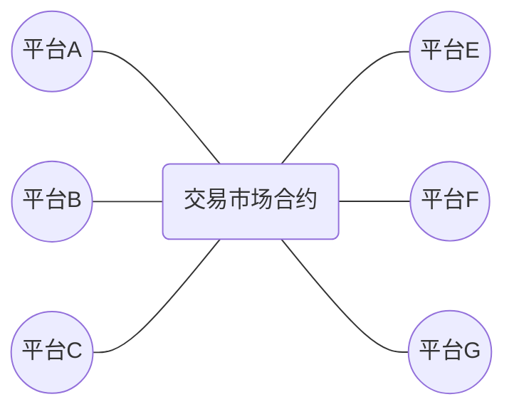
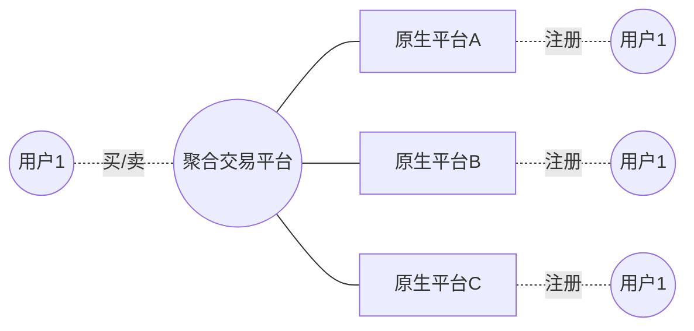

# 去中心化

去中心化面临的以下几个问题：

- token
- 用户门槛
- 节点数量
- 治理
- 监管

## token

没有token，链上资产（NFT）就不能在链上进行交易，必须借助链下支付。

## 用户门槛

用户对于助记词、私钥的学习成本，需要考虑。

## 节点数量

目前我们的验证节点数量只有4个，而且都是在阿里云的同一个内网，万一阿里云出现问题，节点可能面临问题。

增加节点就意味着增加服务器成本。

## 治理

参与的节点如何参与链治理。

## 监管

...

---

# 关于NFT交易平台的构想

- 奇异链上的NFT
- 符合元数据规范
- 元数据和图片存放在IPFS上
- 发行ERC20 Token作为平台间记账和权益凭证

存在的问题：

- token如何兑现？
- 怎样保证合规？
- 洗钱？

# 关于聚合藏品交易平台构想

聚合平台只做信息展示，最终挂单和吃单都在原生平台

面临几个问题：
- 用户同步
- 原生平台没有交易，则不能接入聚合平台
- 不同平台间用户支付

---

# 关于数藏平台思考

如何开放？

# 基于公链的数藏平台分析

| 公链 | 代币 | 代币价格 | 铸造手续费 | 转移手续费 |
|-----|------|---------|----------|----------|
|Conflux|CFX||----------|----------|

