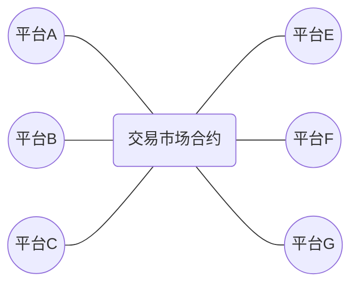
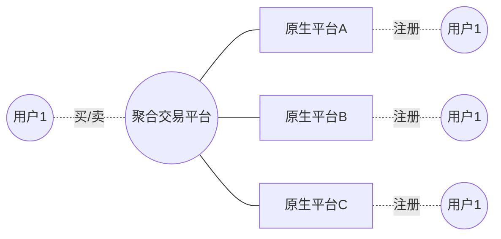

# 去中心化

去中心化面临的以下几个问题：

- token
- 用户门槛
- 节点数量
- 治理
- 监管


## token

没有token，链上资产（NFT）就不能在链上进行交易，必须借助链下支付。

## 用户门槛

用户对于助记词、私钥的学习成本，需要考虑。

## 节点数量

目前我们的验证节点数量只有4个，而且都是在阿里云的同一个内网，万一阿里云出现问题，节点可能面临问题。

增加节点就意味着增加服务器成本。


## 治理

参与的节点如何参与链治理。


## 监管

...

---


# 关于NFT交易平台的构想

- 奇异链上的NFT
- 符合元数据规范
- 元数据和图片存放在IPFS上
- 发行ERC20 Token作为平台间记账和权益凭证




存在的问题：

- token如何兑现？
- 怎样保证合规？
- 洗钱？


# 关于聚合藏品交易平台构想

聚合平台只做信息展示，最终挂单和吃单都在原生平台

面临几个问题：
- 用户同步
- 原生平台没有交易，则不能接入聚合平台
- 不同平台间用户支付




讨论：
```
问题：目前来看所有的业务都只支持奇异链的生态，是否可以奇异链作为最大生态，同时支持蚂蚁链和其他链的生态在稀物进行交易。


关于这个问题，根据平台分为2个子问题：
1、稀物支持我们自己的平台，即稀台，奇异链资产的别的链资产的交易；
2、稀物支持其他平台的奇异链资产和别的链上资产的交易；
=================
第1个子问题，需要在DID中支持蚂蚁链、至信链、其他链，这样就可以支持其他链上资产的交易。
=================
第2个子问题，经过研究，可行性太低。主要存在的问题是：
   a）用户信息壁垒，即其他平台不会将用户信息给我们，这也是最核心的问题
   b)  如果使用去中心化的方式，例如用奇异链上的地址+token作为身份认证（类似公链的做法），又会存在以下几个问题：
        i) token如何兑换？
        ii) 如何保证合法合规？
        iii) 所有的支付走稀物，在没有KYC的情况下，如何防止洗钱等违法行为？我们需要承担其他平台带来的风险。
​
XMeta的模式，类似“闲鱼”，既不涉及不同平台间用户壁垒的问题，又不涉及的资产跨链的问题，只是作为一个中间商赚差价，收取100块保证金，维持基本秩序。应该是实现起来最简单的。
=================
综上，稀物支持稀台的多链资产的交易是可行的；但是，支持其他平台(奇异链、蚂蚁链、至信链)的资产交易，是不可行的。
```

---

# 关于数藏平台思考


如何开放？


# 基于公链的数藏平台分析

| 公链 | 代币 | 代币价格 | 铸造手续费 | 转移手续费 |
|-----|------|---------|----------|----------|
|Conflux|CFX||----------|----------|


