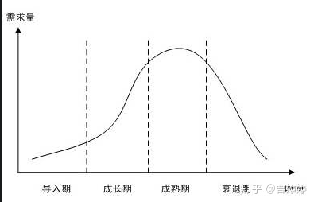

# 国内数字藏品行业现状分析

## 研究报告

- [《激活数字经济的钥匙——2022数字藏品产业研究报告》-速途元宇宙研究院](./files/%E3%80%8A%E6%BF%80%E6%B4%BB%E6%95%B0%E5%AD%97%E7%BB%8F%E6%B5%8E%E7%9A%84%E9%92%A5%E5%8C%99%E2%80%94%E2%80%942022%E6%95%B0%E5%AD%97%E8%97%8F%E5%93%81%E4%BA%A7%E4%B8%9A%E7%A0%94%E7%A9%B6%E6%8A%A5%E5%91%8A%E3%80%8B-%E9%80%9F%E9%80%94%E5%85%83%E5%AE%87%E5%AE%99%E7%A0%94%E7%A9%B6%E9%99%A2.pdf)

- [艾瑞咨询：2022年中国数字藏品行业研究报告](./files/艾瑞咨询：2022年中国数字藏品行业研究报告.pdf)

## NFT与国内数字藏品的区别

数字藏品是NFT的一种应用形式，国内数字藏品与NFT本质区别在于国内数字藏品不具备NFT的**金融属性**及**社交属性**,与虚拟货币划清了明确的界限。

## 国内数字藏品所处的发展阶段

发展阶段(成长期）。

由于加密市场处于熊市，国内的数藏行业的监管政策不明朗，鲸探、幻核这样的头部平台，都没有开放二级市场，加上幻核已经宣布暂停业务，整个行业仍然处于“边走边看”的状态。

## 国内数字藏品驱动

政策驱动。

数字藏品行业的发展必然面对的几个问题是:

- 政策监管？
- 准入门槛？
- 行业规范化？
- 行业大洗牌？
- 赋能实体经济？ “NFT+”？
- 如何持续发展？

## 国内中心化平台与国外去中心化平台的对比

*其中部分数据根据网上数据整理，可能并不准确，仅供参考。2022年10月*

|对比项|中心化平台 | 去中心化平台 |
|---|-------|-----------|
| **政策监管** | 需备案，申办牌照，遵守国内法律政策，如：禁止涉足虚拟货币| 暂无 |
| **底层链** |联盟链（`72%`），公链(`25%`)，生态封闭 | 公链，生态开放 |
| **支付方式** |法币支付| 代币支付|
| **二级市场**|有限制的流转时间、价格。有二级市场的平台占比`30%`|完全开放，无限制|
| 市场分布 | 相对分散（`1000`家左右，逐步淘汰尾部平台）  | 三分天下, 2022年9月份数据：
 OpenSea占比`57.7%` (`3.5`亿美金)，
Magic Eden占`21.1%`（`1.2`亿美金）, 
X2Y2占`11%` (`0.67`亿美金) |
|盈利模式| 发售、手续费（一般为`5%`） | 服务费(Opensea抽`2.5%`, Magic Eden抽`2%`, X2Y2抽 `0.5%`) |
|一级市场| 平台发售为主  | 以个人创作者为主|
| 用户门槛 | 低，中心化平台，技术复杂度对用户透明| 高，用户需要学习基本的密码知识、去中心化钱包知识|
|用户认证 |必须实名认证（身份证号码+姓名+手机号，有些平台会进行人脸识别）|不用实名，无用户信息|
| NFT流通性 | 基于平台，藏品与平台绑定，不能在别的平台流通| 基于链，主流公链上的藏品，可以在不同平台上流通 |
| NFT生命周期 | 由项目运营或平台的生命周期决定 | 由项目运营或社区共识决定  |
|NFT控制权|平台托管|  基于公私钥，用户完全控制自己的账户|
| NFT资源存储 |中心化云服务器 | IPFS|
|NFT交易记录|藏品记录以自己的数据库为准，不解析链上交易 | 交易记录放在链上，数据服务实时基于链进行解析|
| NFT安全性 | 由平台负责，几乎不会有藏品被盗的风险。但是安全性因技术实力不同而各有差异，平台被攻击偶有发生| 用户自己负责，钓鱼事件常有发生，对用户的安全意识的要求越来越高  |
| NFT项目平均运营成本 | 低 | 高 |
| NFT流动性（*提供数据*）| 低 | 低（热门项目较高，绝大多数流动性不足） |

> [opensea占比](https://www.blocktempo.com/dappradar-solana-chain-nft-sales-double-in-september-undermining-opensea-dominance/)

> [平台使用联盟链或公链的占比](https://www.jwview.com/jingwei/html/m/08-18/499419.shtml)

## 国内数藏平台底层链对比

*其中公链的价格根据当前币价进行计算，2022-10-25*
> https://www.szcp100.com/

| 链 | 链类型| 背景  | 平均价（元）| 市场占比 |平台 |
| --- |--   | -- |-- | -- | -- |
|蚂蚁链 |联盟链 | 阿里 | `0.1` | `55.7%`(参考1) |鲸探、其他|
|BSN|联盟链 | BSN联盟| `0.3`(最便宜的) | 未知? | NFTCN、稀象|
|百度超级链|联盟链 |百度 | `1.875`(最便宜的套餐) | 未知? | 美藏 |
|至信链 |联盟链 |腾讯| `0.5`(最便宜套餐) |  未知? | 美藏 |
|华为链|联盟链|华为| 硬件资源型，`50000`起步 |x | ?|
|天河链|联盟链|天河国云| `0.08` | x | 优版权|
|Ethereum|公链|国外|`7` | x | 麦塔 |
|Polygon|侧链|国外| `0.01`| x|唯一艺术|
|Conflux|公链|国内| `0.0001`| x|元境|
|Solana |公链|国外| `0.00202`| x|J-ART |

>
>  - [参考1](https://mp.weixin.qq.com/s?__biz=MzA3MjEwMTQxNA==&mid=2650856156&idx=1&sn=179b7e6b96841e7354d1ad95e5121ee3&chksm=84d70195b3a088835bc8b83da3c829bdcdf0d47a99ab51c3bfbb8fb5b853add5691f8b793e28&scene=27)
>  - [参考2](https://www.nftzxw.com/hynews/16580.html)
>  - [参考3](https://www.jinse.com/news/blockchain/1415330.html)

---

## 海外版BSN调研

其中BSN已经出海，在香港推出了海外版BSN服务

> 官网链接：https://bsnbase.io/g/home/

### 1.链服务
提供了公链和联盟链的服务，

- 9条公链主网（包含测试网）:
  - ETH
  - EOSIO
  - Casper
  - Findora
  - Near
  - Klatyn
  - Tezos
  - Pokadot
  - Oasis

- 联盟链
  - 提供了定制化的服务，需要客户提交申请

### 2.服务器分布（亚马逊云AWS）

- Hong Kong 中国，香港
- California 美国，加利福利亚
- Pairs，法国，巴黎

### 3.收费标准

在收费上，香港地区提供了免费版。California 和 Paris 没有提供免费版。
收费版分为：基础版、专业版、企业版、自定义版本等4个版本。

| 版本 | 收费（美元/月）| 日请求量 | 最高TPS | 项目数量(个) |
|-----|------| ---|--------|----------|
| 免费版(仅限香港)| 0 | 2,000|  10| 3 |
| 基础版 | 20| 20,000 | 100 | 10|
| 专业版| 100| 125,000 | 100| 50 |
| 企业版| 500| 750,000 | 100| 100 |
| 自定义版| - | - | - | - |

---

## 行业展望

- “NFT+”实现应用
- 合规化
- 二级市场规范化
- 头部平台占有绝大部分市场份额
- 社交属性会发挥潜力

## 现在我们可以在哪方面努力？

- 更多创新
  - 模式创新
  - 技术创新
  - 结构创新
- 更开放
  - 奇异链开放
  - 稀台提供更多的开放接口
  - 与更多的平台合作
- 更合规更规范
  - 更多的内部约束和外部规范
- 更好的用户体验
  - 细节优化
  - 一键登录
  - 更方便的支付方式
- 更好的B端服务
  - 运营面
  - 技术面
- 更多的应用场景探索
  - 品牌营销
  - 实物收藏品？
- 更多的用户教育
  - 让更多用户深入了解这个行业
- 更好的反馈渠道
  - 用户反馈
  - 市场反馈
  - 客户反馈
- 更好的数据预测模型
  - 藏品铸造、转移

## 如何更开放？

### 其他平台的探索

元境，基于国内的Conflux公链(树图链），一个国内的Opensea，也有类似Metamask的钱包，Anyweb，用户自己保管私钥。与opensea最大的区别就是，用法币支付，不支持用币支付。
> https://www.cymirror.com/

元境的这种模式是在国内政策允许的范围内，能够做到最去中心化和最开放的。

---

一些平台基于公链，比如“唯一艺术”、“麦塔”。但是麦塔的藏品流转记录并没有上链，而是采用了中心化的方式记录，只有在导出藏品（导出到外部地址）的时候才会上链，且导出费用过高并跟随ETH币价浮动。唯一艺术，使用了polygon，但是用户并没有自己的地址。

