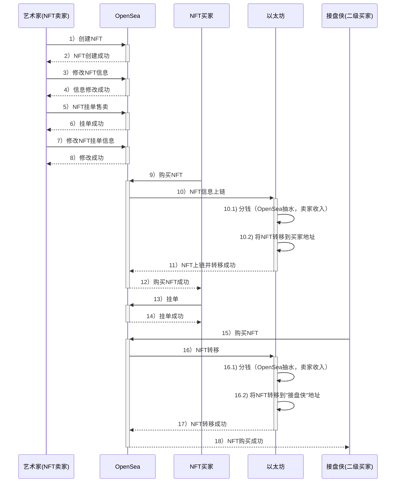

# OpenSea协议分析

在OpenSea上发行NFT，在没有正式成交前，NFT的记录是不会上链的：

- 在NFT没有卖出前：
  - 链上是没有记录的，都是中心化存储
  - NFT的信息是可以修改的
  - 挂单数据不上链
  - 挂单价格可以修改

> 示例： https://OpenSea.io/zh-CN/collection/hi2032

- NFT在成交时：
  - OpenSea会将NFT信息上链
  - TokenId是一串hash
  - 图片URI 
  - 使用`ERC1155`标准，不存在`mint`概念

NFT示例：https://etherscan.io/nft/0x495f947276749ce646f68ac8c248420045cb7b5e/98745491564379547554924435713421898077677728399868739538264606794153742827521

普通售卖：

https://etherscan.io/tx/0x5ffc4bf19bd71a7975c0f4b819acdba789b669ccb0f0b9bf9795fd84dedb9e24

拍卖（由卖家决定, 即由卖家发起）：
https://etherscan.io/tx/0x066b6fceed0601d3d44e37251fd3de60ac0ac317e6f8e965d485dd6c6f4e0a15

