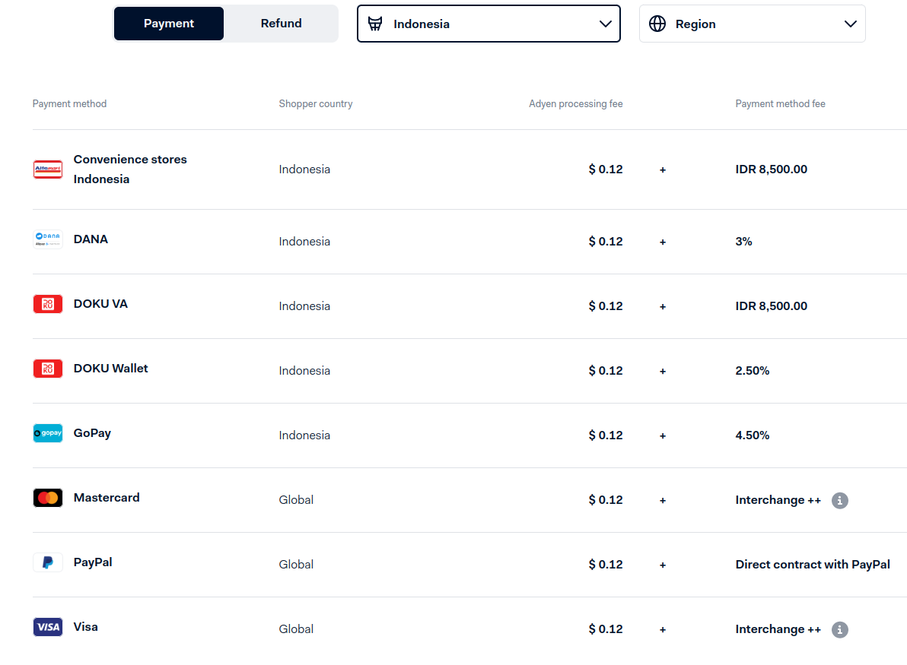
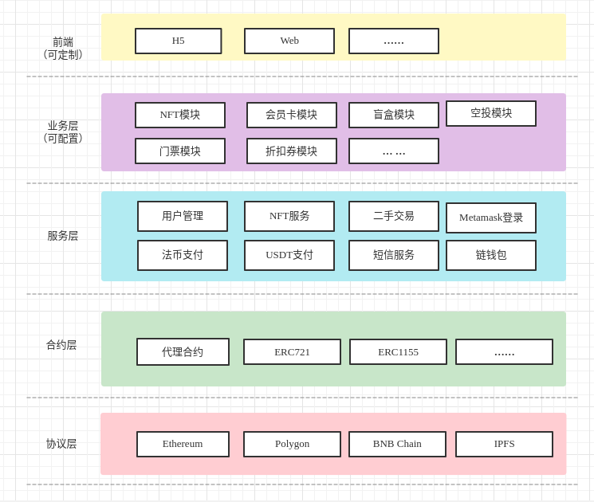
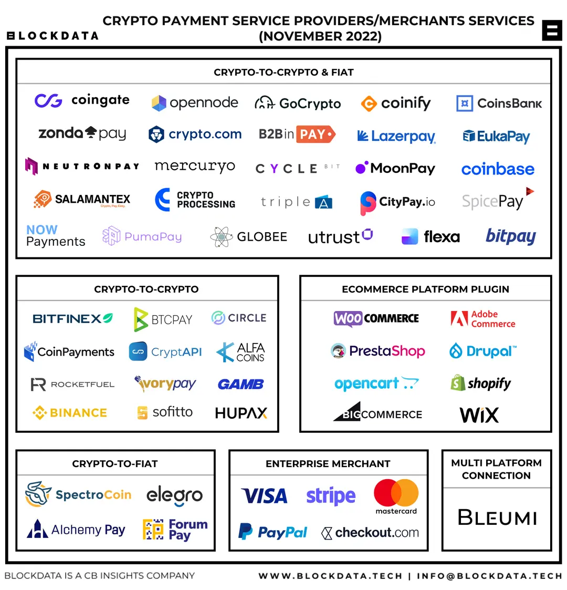
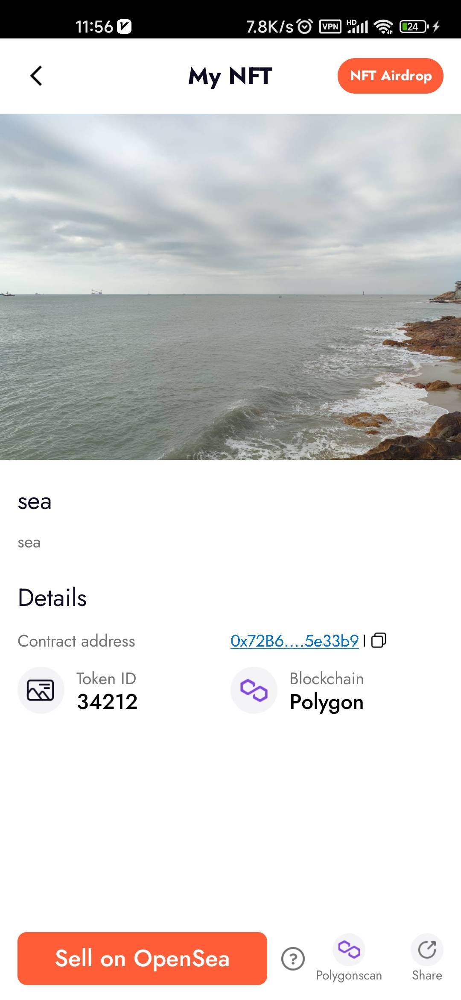

# 海外版NFTSaaS

## 非技术面

定位： 面向海外（东南亚，南亚）市场的NFTSaaS平台

> 以下“海外”特指“东南亚”

SWOT分析法：
- 优势(Strengths)：
  - 已有国内NFTSaaS的产品、市场、技术、运营、销售、客户等方面的资源和经验
- 劣势(Weaknesses)：
  - 缺少对海外（东南亚）的移动互联网发展情况的调研；
  - 缺少海外产品、市场、运营、销售、客户等方面的实际经验；
  - 缺少对海外NFT市场、产品需求的调研；
  - 缺少对海外用户的产品使用习惯的调研（社交软件+H5？）；
  - 缺少海外法币支付的业务和技术的对接经验。
- 机会(Opportunities)：
  - 双重支付模式：OpenSea这些平台不支持法币支付，对普通用户门槛较高，我们可以支持快捷的法币支付降低用户门槛；
  - "NFT+"的模式 : OpenSea这些平台不能与现有的服务融合，通过我们的NFTSaaS可以与现有模式进行融合
  - 行情：当前处于熊市
- 威胁(Threats)：
  - 政策（合规性）：除了新加坡对与虚拟资产有明确的开放的政策外，其他东南亚国家的政策尚未明朗；
  - 支付：其中不同国家的法币支付（第三方支付机构）是否有国内这样完善？如果有，资质审查？
  - 有OpenSea、MagicEden这样的强大的竞争对手；
  - 行情：当前处于熊市，市场情绪低迷

---
## 技术面

## 服务器方案

### 方案1：共用国内版的服务器和数据库
  - 优点：
    - 短期内硬件成本低
  - 缺点：
    - 国外请求回国的速度和稳定性不能保证（有国家防火墙）
    - 耦合度高：后续海外版的改动，会大大受国内版的限制和束缚
    - 只能从逻辑层面（代码逻辑）隔离国内版和海外版的业务

### 方案2：独立一套
  - 优点：
    - 海外云服务商不会“管闲事”：使用海外云服务商（如亚马逊）的云服务器重新部署一套`SaaS+DID`
    - 海外版可以根据实际情况，及时修改和调整，不会影响现有的国内版
    - 可以在物理层面进行隔离，不会影响现有的国内版
  - 缺点：
    - 前期投入成本高（具体数据，待国辉估算）
    - 需要重新部署和测试

## 研发工作
- 1、当地法币支付接入
- 2、多语言翻译（繁体中文、英语、越南语、泰语、马来语、印尼语）
- 3、UI与多语言适配、UI根据东南亚人使用习惯和审美进行调整
- 4、当地是否需要实名？如果需要，需要接入实名认证，防止洗钱。
- 5、支持Twitter、Google、Facebook、Instagram、WhatsApp 这些社交账号的授权登录？
- 6、当地是否允许炒作？如果可以，提供自动化做市工具？
- 7、海外域名注册? 备案？
- 8、其他技术注意事项（手机号码？短信服务？时区？ 分账逻辑是否改变？）

## 链上账户方案

### 方案1——去中心化

改变当前的链上账户设计，将私钥交给用户，类似OpenSea、MagicEden的模式。

如果按照这个方案，SaaS和DID需要改变的：

- 藏品锁单的逻辑
- DID需要监控链上的交易（可以使用现有的服务商的API完成）

### 方案2——中心化

保持现有的账号逻辑不变，即用户的私钥由我们平台托管，用户用法币支付，我们帮用户上链

---

## 公链选择

在公链的选择方面，我们应该基于以下几点：

- 主流的公链、主流公链的侧链或Layer2
- 手续费低

例如：ETH、Solana、Polygon、BSC、Optimism

### Solana的NFT API封装与调用(已完成)

- https://github.com/qiyichain/solana-nfts
- API服务： https://github.com/qiyichain/solana-nfts/tree/master/solana-nft-api

### Polygon的NFT合约封装与调用(已完成)

- https://github.com/qiyichain/polygon-nfts
- 合约继续采用封装合约即可（增加Polygon的网络配置）：
  - https://github.com/qiyichain/standard-contracts

---

## 海外版NFT SaaS

- 应用场景(客户需求)：
  - 演唱会门票
  - 粉丝经济
  - NFT交易平台
- 要求：
  - 能够同时服务上面3个应用场景
  - 低代码， 类似稀台NFTaaS的模式
  - 移动端为主
  - 更轻量，可以借鉴Slash
  - 支持多公链
  - 能上OpenSea
  - 多种玩法：优先购、分批购、合成、盲盒、空投、销毁、繁殖……
  - 多种支付方式：
    - 法币: Visa、MasterCard……
    - 加密货币: USDT、ETH？

- 问题：
  - 是否需要注册海外公司？
  - 支付接入是否有统一方式，即支持东南亚各国的支付？
  - 中心化和去中心化？ 如果用合约实现多种玩法，成本问题如何解决？

### 法币支付

> https://zhuanlan.zhihu.com/p/345078015

Visa，Master，AE, JCB海外支付接口怎么接入？
- 1，Visa或者Master等卡组织是不直接面对客户的，都是由**第三方支付公司**或者**海外收单行**直接对接。
- 2，接入方面先说一些行业不能接入：涉及到黄赌毒，高仿，一元夺宝，非授权，电子烟，刀具等，具体行业依据具体产品具体分析。
- 3，接入方面资质问题：
  - a，境内公司一般是三证，银行开户许可证，法人身份证等。
  - b，境外公司一般是法团成立信息表，注册证明以及法人护照，结算银行信息等。海外具体要看哪个国家。其次具体的行业可能需要行业的相关认证比如航旅行业、医疗行业等。
- 4，接入一般会提供API，SDK，收银台等技术对接文档。需要商户自己有相关的联调能力。如果是通过建站公司建站，支付对接这块一般都不需要商家自己来解决。
- 5，接入时间问题，一般商户签约流程1天，申请通道一般3个工作日，对接一般5个工作日左右，还需要测试然后就能上线。

要看企业需求结算币种，如结算人民币：
- 1：税务登记证
- 2：银行开户许可证
- 3：营业许可证
- 4：法人身份证
- 5：组织机构代码证
以上五证是必备哦

如结算外币：
- 1： 法团成立表格
- 2：银行账户相关资料
- 3：法人护照

## 支付公司

- xendit: https://www.xendit.co/zh
  - API对接文档：https://developers.xendit.co/api-reference/#introduction
- monetapay: https://www.monetapay.id/home
  - API对接文档： https://docs.monetapay.net/payment
- instamoney: https://www.instamoney.app/
- adyen: https://www.adyen.com/pricing
- 新加坡的：https://www.codapayments.com/
- 钱海支付（深圳）：https://www.oceanpayment.com/cn/?lang=cn
- GoAllPay(上海): https://www.goallpayx.com/cn/index.html

- 支付渠道：https://www.zhihu.com/question/60049935

adyen的印尼支付：

## 出海服务

- 一站式服务： https://www.thexnode.cn/go-sea/singapore
- 海外银行开户： https://www.lanyiit.com/account/
- 新加坡开设公司： https://uniprohk.com/%e5%a6%82%e4%bd%95%e9%96%8b%e8%a8%ad%e6%82%a8%e7%9a%84%e6%96%b0%e5%8a%a0%e5%9d%a1%e9%9b%a2%e5%b2%b8%e5%85%ac%e5%8f%b8/

- 腾讯云的一站式出海服务： 还在开发中
- 扬帆出海， 互联网出海服务： https://www.yfchuhai.com/
- 跨境支付： https://www.airwallex.com.cn/

---

## 技术

- 整体架构

  

- 技术方案
  - 方案1——PaaS平台：上层业务端单独开发，采用类似`GET Protocol`票务标准接口的架构模式，即`非侵入式`
  - 方案2——NFT票务：专注NFT票务，不考虑其他应用场景

- 编程语言选择
  - Python:
    - https://github.com/qiyichain/pretix
  - Javascript:
    - https://github.com/qiyichain/NFTicketize
  - Golang
    - 优：
      - 使用go-zero框架，可以大大缩短上线时间，
      - 同样的硬件配置下，性能远高于Java
      - 同样的要求下，可以降低硬件资源70%，服务器成本可大幅度降低
    - 劣：
      - 公司Go的开发人员少，后端全是Java开发
      - 不能复用现有SaaS的成熟的模块的代码
  - Java
    - 优:
      - 公司开发人员多
      - 有现有SaaS开发的经验
      - 可以复用很多模块的代码
    - 劣：
      - 开发周期较长
      - 硬件要求高，服务器成本高

- 云服务商选择
  - 亚马逊
    - Fargate（自带K8S服务）
  - 阿里云
    - 价格： **15万人民币**（仅服务器成本，不包含短信、CDN等费用），按照SaaS配置在新加坡按年购买的价格（优惠价）
  - 华为云

- 技术细节
  - Metamask、WalletConnect登录
  - Facebook、Google登录
  - 海外手机号登录？
  - 信用卡支付、三方支付接入、
  - 智能合约
  - Rarible 协议标准
    - Rarible协议API文档: https://docs.rarible.org/api-reference/
  - 分布式事务
    - DTM：https://dtm.pub/

- 客户需求：
  - NFT票务网站：
    - 国外票务网站：
      - 使用了[2c2p](https://2c2p.com/)支付的票务网站： https://www.ticketmelon.com/
      - Live Nation: https://www.livenation.sg/
      - cityline: https://www.cityline.com/
      - ticketmaster: https://ticketmaster.sg/ticket/area/23_blackpink/917
      - 现有的门票网站： https://www.viagogo.com/Concert-Tickets/K-Pop/BLACKPINK-Tickets
        - 5种支付方式：Visa、MasterCard、Amex、JCB、其他信用卡
    - 可以参考GET协议的API接口方案:
      - 票务浏览器： https://explorer.get-protocol.io/
      - API接口： https://docs.get-protocol.io/reference/concepts-overview
      - 几个使用GET协议的票务网站：
        - jeike: https://www.jeike.io/
        - neonox: https://neonox.io/how-it-works.html
        - defy: https://defytickets.com/
        - https://relictickets.com/
        - https://www.ontapp.app/
    - NFT + 粉丝经济
      - https://www.graflr.com/

- 支付方案
  - 法币支付：
    - **需要确定一个三方平台，提供信用卡、电子钱包、银行卡等支付**
    - 支持国际信用卡、电子钱包、银行卡、微信、支付宝： https://2c2p.com/
  - 用户可以用信用卡支付，购买NFT
  - 平台垫付gas费 + 抽水
    - Polygon手续费: transfer($0.001), mint($0.01)
    - ETH手续费：transfer（$0.8）, mint($1.62)
    - BNB Chain: transfer($0.1), mint($0.1)
  - 加密货币支付：我们自己对接USDT支付（TRC20、ERC20、USDC ）
  - 其他支付平台
    - 法币-币：
      - https://nftpay.xyz/integrate-now/
      - https://www.moonpay.com/business/nfts
      - https://triple-a.io/

    - 加密货币
      - TRC20-USDT支付： https://github.com/qiyichain/epusdt

      - 使用ethplorer的监控API，实现入账监控，减少自己实现的复杂度： https://docs.ethplorer.io/monitor?from=apiDocs#section/Introduction

      

      - https://coingate.com/
      - https://bitpay.com/
      - https://www.opennode.com/

  - 加密货币支付平台
    - 为什么不自己做？ 不重复造轮子，市面上早已有成熟的解决方案，比自己做更节省时间，提高效率。
    - TRC20-USDT支付： https://doc.tronapi.com/
    - https://blog.mugglepay.com/#/README-CN

----

## 其他NFT应用体验

### UniPixel

- 使用App需要缴费：
  - 1月： $12.99
  - 1年： $64.99
  - 永久： $81.99

- 合约代码（ERC721），所有NFT共用一个ERC721合约：
  - https://polygonscan.com/address/0x72b6dc1003e154ac71c76d3795a3829cfd5e33b9#code

- 公链：
  - Polygon： 免费mint，平台支付手续费，NFT所有人为用户
    - 例如： https://polygonscan.com/tx/0x3399c9a9fb1127a3f1efeef546110b60498bc50b43fbda3b954cbb8ecd4f8560
  - Ethereum： 不免费

- 图片存储(IPFS)：
  - https://app.unipixelapp.com/ipfs/Qme8ep9aYqPWPUYKidgaHYf5t4BGRFVWWPhGrjG9FYRSEM
  - https://ipfs.io/ipfs/Qme8ep9aYqPWPUYKidgaHYf5t4BGRFVWWPhGrjG9FYRSEMNFT

- 支持AI创作

- app截图：
  - 

