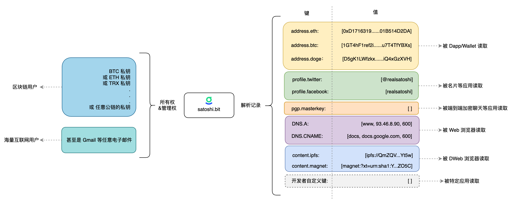
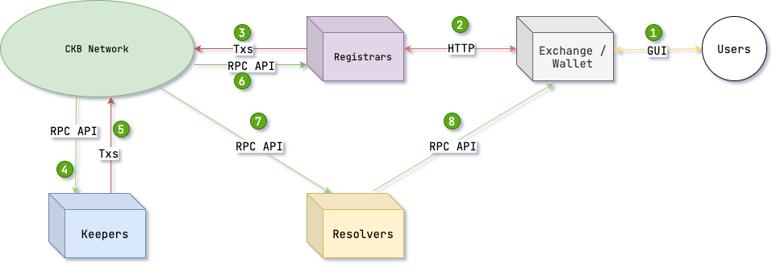

# .bit域名研究


> 问题： `.bit`域名和ENS域名的相同点？不同点？有什么关系？

## `.bit`的定义

`.bit` 是基于区块链的，开源的，跨链去中心化账户系统.bit 提供了以 .bit 为后缀的全局唯一的命名体系，可用于加密资产转账，域名解析，身份认证等场景。作为去中心化账户系统，有且仅有用户拥有 .bit 账户的完整控制权和使用权。同时，.bit 也是第一个具有广泛兼容性的去中心化账户系统，可使用任何公链地址甚至电子邮件来注册和管理 .bit 账户。


## `.bit`的愿景

> `.bit` 之于加密世界，如 手机号/Email 之于互联网。




## `.bit`的定价

> https://docs.did.id/register-das/pricing

|Account  Character Length	| Price	 |Price after filling in the invitee ( x0.95 ) |
|----|-----|----|
5 digits and above	| $4.99/year	|$4.75/year
4-bit	|$160/year	|$152/year
3-bit	|$660/year	|$627/year
2 bit	|$1,024/year	|$972.8/year


## 技术架构

> https://github.com/dotbitHQ/das-contracts/blob/master/docs/zh-hans/%E7%B3%BB%E7%BB%9F%E6%A6%82%E8%A7%88.md



1. 用户首先需要通过交易所、钱包中的浏览器访问 DAS 的注册服务；
2. 注册服务(`Registrar`)可以是由任何人实现的为用户提供 DAS 注册功能的 web 服务，当然不仅限于 web 服务，任何可以帮助用户完成链上交互并获得账户的应用都可以称为注册服务；
3. 注册服务将用户的注册请求以及其他各种操作转换成交易，通过钱包让用户签名后上链；
4. 守护服务(`Keeper`)是去中心化的 DAS 节点，随时通过节点 RPC 监控链上交易；
5. 当发现需要处理的用户交易时，就按照交易结构协议创建特定的交易完成诸如账户注册等工作；
6. 如果注册服务做的比较完善，可以通过节点的 RPC 监控用户的账户注册等状态，并在成功后及时的反馈用户；
7. 当用户注册成功账户，并设置解析记录后，解析服务(`Resolver`)就可以通过节点 RPC 解析链上区块获取数据；
8. 最后，解析服务通过自己的 RPC 接口将数据提供给钱包、交易所等需要使用解析记录的应用完成对用户账户的利用；


## 智能合约源码

合约实现非常简洁，和普通ERC721合约基本一致


```solidity

mapping(uint256 => uint) private expires;

function mint(address to, address uuid, uint256 expireAt) external onlyRole(MANAGER_ROLE) {
        uint256 tokenId = uint256(uint160(uuid));
        require(expires[tokenId] + GRACE_PERIOD <= block.timestamp, NOT_EXPIRES_MESS);
        if (_exists(tokenId)) {
            _burn(tokenId);
        }
        expires[tokenId] = expireAt;
        _mint(to, tokenId);
}
```

## `.bit` 的生态

> https://www.did.id/ecosystems

- imToken、TrustWallet、TP钱包等等去中心化钱包中可以使用`.bit`进行转账和接收
- NFTScan、NFTGo可以使用`.bit`登录
- 即刻App（国内基于兴趣的社区平台）： 将账户昵称设置为`.bit`域名之后，可以显式账户下的NFT藏品
- 其他应用场景


## 总结


问题： `.bit`域名和ENS域名的相同点？不同点？有什么关系？

- 相同点： `.bit`和`ENS`一样都是链上域名服务
- 不同点： `.bit`过于依赖链下服务，去中心化的程度没有ENS高
- 关系： `.bit`更多是对于ENS的模仿，有创新，但不多，`.bit`目前能做的， `ENS`也可以做


个人觉得，`.bit`在年中的时候趁了一波`ENS`带起来的“域名热”。俗话说“打铁还需自身硬”，由于`.bit`项目本身缺少创新，基本是对于ENS的模仿。项目方抓住“域名热”的市场机会卖域名，市场炒家借机炒作，“狂欢”之后，真正给生态带来的改变非常有限。

