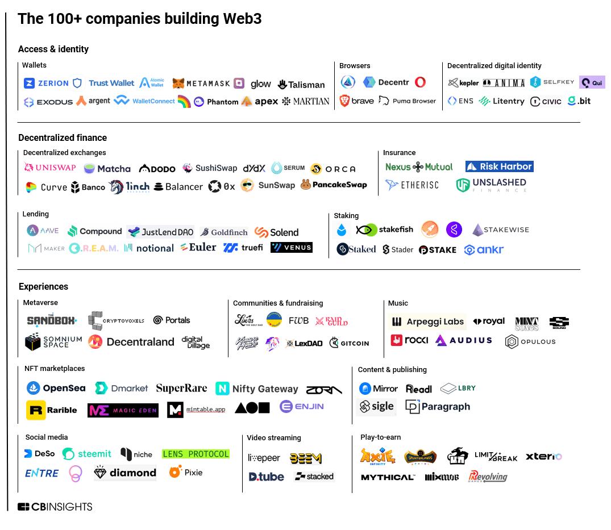
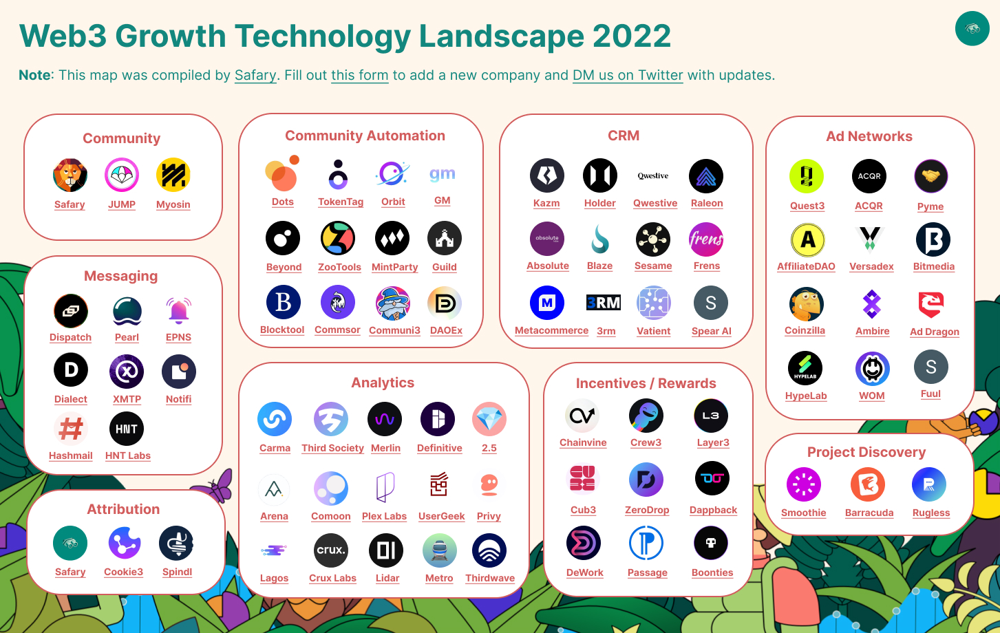

Web3项目：

---

Web3增长：

# 项目发现
## smoothie

- https://smoothie.so/litepaper

- 由社区用户提交新项目，平台审核，社区投票，获胜的项目可以获得分数、NFT、以及社区的反馈。

# 游戏

- https://game.defikingdoms.com/

# NFT utility

> https://twitter.com/withmattkim/status/1468604476063895558?s=20&t=INcJ4MrgpEuI2vJLgLLqoQ

- 会员卡: 用于仅限会员访问活动和派对。
- Discord频道: 只允许拥有特定 NFT 的人加入 Discord 频道。
- 实体: 您可以使用 NFT 来获得您的艺术作品的实体版, RTFKTstudios 有运动鞋 NFT，你可以购买真正的运动鞋）
- 投票： NFT 可用于为组织决策投票。
- 繁殖： 使用NFT创建新的NFT， 你可以通过2个加密猫(CryptoKitty)繁殖得到1个"小猫"NFT。
- 合成： 通过2个NFT合成1个
- 销毁： 销毁NFT， 让NFT永久退出流动
- 空投： 给用户空投免费NFT
- 碎片化： 将一个NFT分裂成多个NFT
- 抵押： 抵押NFT获取收益，例如 [wolfdotgame](https://wolf.game/)

NFT机会：

- NFT和游戏结合，例如[defikingdoms](https://defikingdoms.com/)用NFT作为游戏中的“英雄”
- NFT管理工具，用NFT工具
