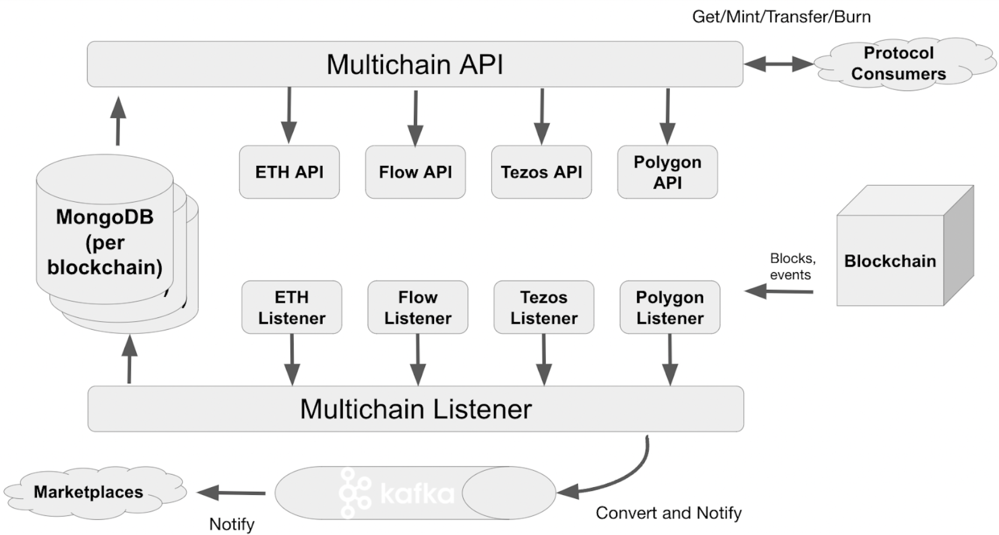

# Rarible协议

- 是什么？
- 干嘛用的？
- 能否符合我们的应用场景？

> https://docs.rarible.org/overview/protocol-overview/

## 是什么？

Rarible Multichain Protocol 是一个去中心化的工具集，可简化开发人员使用 NFT 的方式。协议为多个区块链构建一个抽象层，并使用 Multichain SDK 将开发人员与他们的细节隔离开来。

Rarible 多链 SDK 使应用程序能够轻松地与 Rarible 协议交互：在任何支持的区块链上查询、发行和交易 NFT。

架构:

---

##  干嘛用的？

Rarible开源了后端前端代码，并提供查询API（封装成了JavaScript的SDK），因此可以应用以下场景：

- 构建自己的NFT交易平台
- 构建自己的NFT相关应用平台
- 查询Rarible的API获取链上NFT数据
- 通过Rarible的API发型NFT
- 构建自己的DApp（前端 + 后端）
- 其他

## 能否符合我们的应用场景？

完全可以。

但是， 因为Rarible只提供了JavaScript的SDK， 这一点需要注意。

## 使用Rarible的示例

示例

https://github.com/qiyichain/rarible-nft

