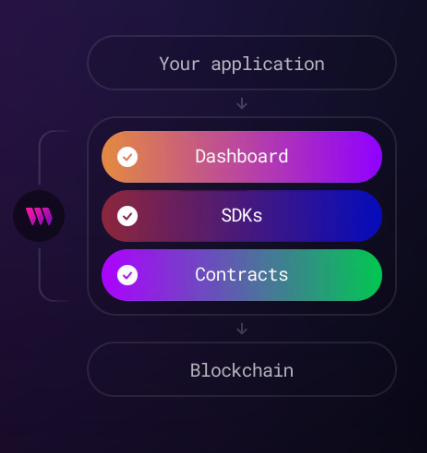

## AIGC工具

- Midjourney(收费):

- craiyon(免费)：
  - https://www.craiyon.com/
  - 生成的质量不太好

- fotor(收费): https://www.fotor.com/features/ai-image-generator/

- https://huggingface.co/

- https://beta.dreamstudio.ai/

## NFT工具

调用AIGC平台的API接口，在我们的平台中实现AIGC功能：

以下列出几个平台：

- Hotpot(收费):
  - https://hotpot.ai/
  - API文档： https://hotpot.ai/docs/api
  - NFT生成： https://hotpot.ai/blog/how-to-make-nfts?s=nft-generator
  - NFT混合: https://hotpot.ai/nft-collection-maker?s=nft-generator

- Bueno(免费， NFT合成工具)
  - https://www.bueno.art/
  - 没有API接口

- manifold（免费的NFT发布工具）
  - https://studio.manifold.xyz/apps
  - 文档： https://docs.manifold.xyz/v/manifold-for-developers/
  - 支持Goerli测试网， 创建合约体验很好, 以下是在测试网使用的
    - https://testnets.opensea.io/collection/laosiji-v2
    - https://goerli.looksrare.org/collections/0xc75ec9cbe0fea99d2da57aff77d47d4e9b8cd7bd

- thirdweb(免费工具， Web3开发框架，非常牛逼)
  - https://thirdweb.com/
  - 文档： https://portal.thirdweb.com/
  - 导航： https://blog.thirdweb.com/
  - 手册： https://blog.thirdweb.com/guides/
  

- autominter
  - https://www.autominter.com/

- fotor
  - https://goart.fotor.com/

- genfty
  - https://www.genfty.com/

参考文章：

- https://mpost.io/7-best-ai-art-generators-of-2022-midjourney-dall-e-nightcafe-artbreeder/#h-1-midjourney

- https://mpost.io/best-8-nft-ai-art-generators-create-10000-nft-collection-for-free-and-no-code/#h-1-appypie-nft-generator
- https://www.bueno.art/blog/smart-contract-generators

---

NFT新玩法-burn-redeem：

> https://docs.manifold.xyz/v/manifold-studio/apps/burn-redeem-app

基本思路：通过 销毁 n 个NFT 来 mint  1个新的NFT  (目前只有ERC1155协议）