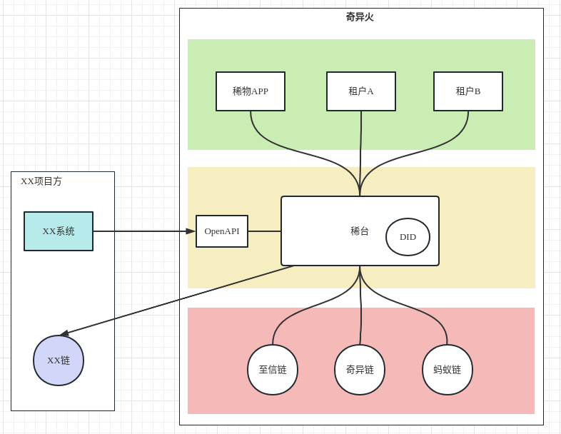

<!--
 * @Author: yqq
 * @Email: youngqqcn@gmail.com
 * @Date: 2023-02-08 10:27:14
 * @Description: file content
-->

# 2023外部项目方接入

## 项目方需求

- 独立的链，链数据可控（掌握在自己手里）
- NFT可以上稀物交易

## 技术方案

一共有3种方案，综合考虑之下，将其中2种方案排除，只剩下方案A具有可行性

### 方案A

- 细节
  - 等稀物稀台融合之后（4月初）
  - 等OpenAPI完全开发完成之后（？）
  - 使用奇异链现成代码，单独搭建一条xx链
  - xx链完全由项目方掌握（他们的服务器，他们的运维）
  - 项目方通过OpenAPI接入

- 开发时间(估算)
  - 2周

- 客户成本估算
  - 服务器成本， 15万元/年：
    - 4验证节点、2个观察节点
    - CDN、带宽、其他云服务设施
  - 开发人力成本
    - xxxx
  - 其他成本
    - xxxx

<!--
### 方案B（急）

- 细节
  - 现在立刻开始，不等稀物稀台融合
  - 使用奇异链现成代码，单独搭建一条xx链
  - xx链完全由项目掌握（他们的服务器，他们的运维）
  - 稀台对接xx链
- 时间
  - 开发两周。2月底可以交付。

- 成本估算
  - 服务器成本， 15万元/年：
    - 4验证节点、2个观察节点
    - CDN、带宽、其他云服务设施
  - 开发人力成本
    - 链部署：1人/周
    - 稀台Java后端对接：2人/周
    - 测试人员（1人）：1人/周
    - 产品UI：1人/周
  - 其他成本
    - xxx
-->

