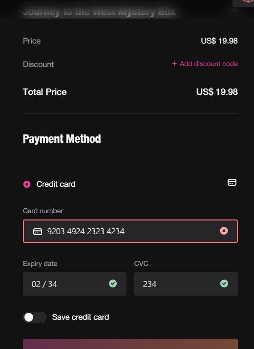

<!--
 * @Author: yqq
 * @Email: youngqqcn@gmail.com
 * @Date: 2023-02-25 14:26:43
 * @Description: file content
-->
# 香港NFT和支付


- popsible NFT交易平台
  - https://popsible.com/zh/nft/dudo-%E4%BA%BA-no014
  - 支付使用 stripe
- https://app.ucollex.io/
  - 信用卡支付（不确定具体用的哪个支付公司）
  


- 台湾NFT平台：
  - https://creator-timeverse-prod.netlify.app/crypto/products/48909


# 加密货币支付

- https://www.simplex.com/solution/nft-dir3ct

  - 费率

    ```
    Please be informed that as with all credit/debit card purchases, there are associated fees.

    When purchasing from one of our partners, Simplex’s fee ranges between 3.5% to 5% of the total transaction, usually with a minimum of $10. There might be an additional fee for the specific platform you are using, and it will be somewhere in this range as well.

    If you are purchasing on Simplex.com directly, the fee can range from 13 to 17%. (with a minimum of $10).

    ```

  - VAT 10%左右， 根据各个国家具体而不同

  - 结算货币
    -  https://integrations.simplex.com/docs/supported_currencies