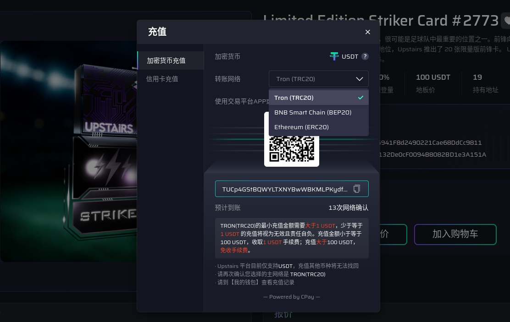
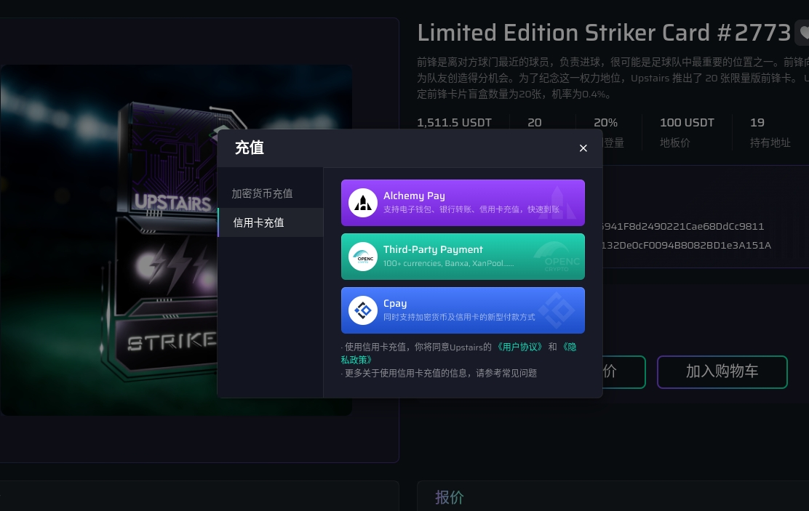
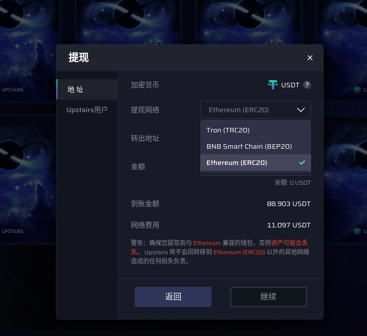
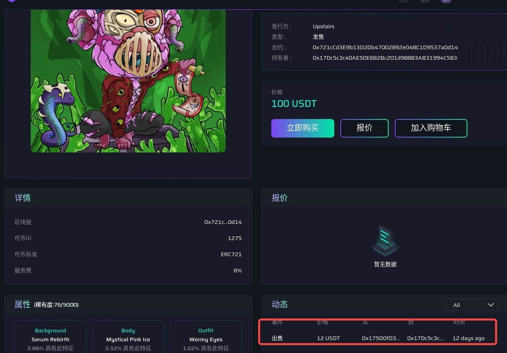

<!--
 * @Author: yqq
 * @Email: youngqqcn@gmail.com
 * @Date: 2023-02-28 18:48:50
 * @Description: file content
-->

# Upstairs

- 入金

  - 直接充币(USDT), 每个用户单独的充币地址，因此，资金需要归集
    - TRC20
    - BEP20
    - ERC20
    
  - 信用卡买币(USDT)
    - Alchemy Pay: https://alchemypay.org/
    - Third-Party Payment: https://openc.pro/
    - Cpay: https://cashier.cpay.ltd/
    

- 出金
  - USDT提币
    - TRC20: 手续费 `3.1%`
    - BEP20: 手续费 `3.1%`
    - ERC20: 手续费 `10.1%`
  - 内部账户转账（实际上不算出金）
    - `0`手续费
  

- 链
  - 没有链。不是Ethereum、Polygon、Optimism、BNB Chain、Arbirtrum，都没有搜索到NFT合约地址
  - 根据[报道](https://mirror.xyz/11nftclub.eth/Gz_gxfIYHxLCS6MQpvg4Cus8aMHmCDoLBIEaO19-9vc)，Upstairs**自己搞了Layer2链**，没对外公开
  - NFT合约、钱包地址不可查
  - 交易记录不可查
  - 用户的钱包地址和 USDT充币地址是2套独立的地址体系，没有任何关系

- 交易
  - 每笔交易手续费: 6%
  - Gas费： 0
  - 类似OpenSea的报价方式
  - 交易记录不可查询，完全是黑箱操作
  

- Token （UGT）
  - 代币玩法：https://www.upstairs.io/announcement/info/?id=150
  - 他们自己搞了“奖励积分”（UGT）,
  - 没有上交易所
  - 规定价格： 1 UGT = 0.01 USDT
  - 质押NFT可以获得UGT奖励
  - UGT可以“提现”
  - UGT可以参与抽奖（买彩票）

- 游戏
  - 用USDT或UGT折扣券抽奖（买彩票），奖励为USDT
  - 页面： https://www.upstairs.io/guess-game

- KYC
  - 很严格
  - 需要身份证、护照、驾照
  - 活体验证、人脸识别

