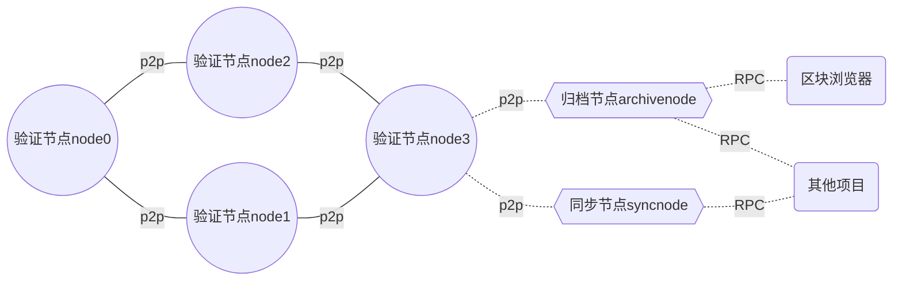

# 1.主网服务器成本

节点类型定义：

- 验证节点：参与共识和链治理，不直接对外提供节点服务
- 同步节点：不参与共识和链治理，直接对外提供节点服务（RPC、WS）

`

## 主网验证节点服务器成本

### 各个数据增长量与交易数的关系

| 交易数(万笔) | 验证节点数据量增加(GB) | 归档节点数据量增加(GB) | 区块浏览器DB数据增量(GB) |
|--------|-----------|--------| --- |
|100|0.4|3| 6 |
|1000|4|30| 60 |
|10000|40|300| 600 |
|100000|400|3,000| 6000 |

主网`4`个验证节点，采用以下配置

- `8 cores CPU` intel
- `16G RAM`
- `500G SSD` IOPS 大于5万, (前期500G够了，后续再扩展)
- 带宽（因为节点间都是内网通信，不作要求）

### 主网同步节点服务器成本

2台同步节点，采用以下配置:

- `8 cores CPU` intel
- `16G RAM`
- `500G SSD` IOPS 大于5万, (前期500G够了，后续再扩展)
- 对外带宽(5M+)

### 主网区块浏览器服务器成本

> https://docs.blockscout.com/for-projects/resource-requirements

- 16 core, 32 thread, intel
- 32GB RAM
- 对外带宽(3M+)
- 数据库 500G SSD  IOPS 大于5万, (前期500G够了，后续再扩展)

以阿里云为例，按照阿里云华南区（深圳）的价格，1台服务器1年的费用为 `37928`元

# 2.测试网服务器成本
## (测试网)节点服务器成本

以测试网4个节点计算，采用以下配置

- `8 cores CPU` intel
- `16G RAM`
- `250G SSD` IOPS 大于5万, (前期250G够了，后续再扩展)
- `5M` 带宽

## 测试网同步节点服务器成本

测试网，可以不用同步节点

## 测试网区块浏览器服务器成本

- `8 core` intel
- `32GB RAM`
- 数据库 500G SSD  IOPS 大于5万, (前期500G够了，后续再扩展)
- `5M` 带宽

