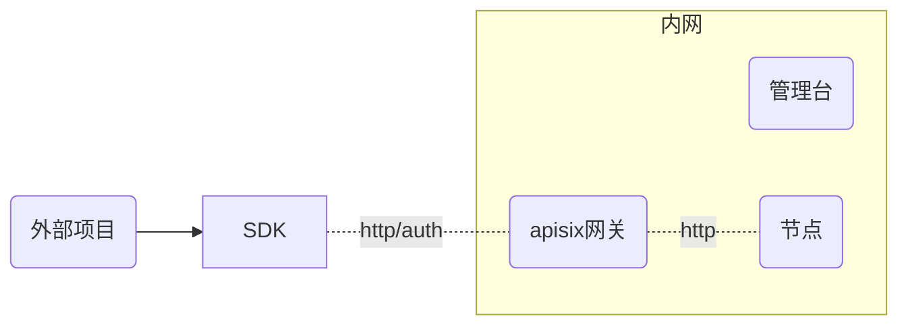
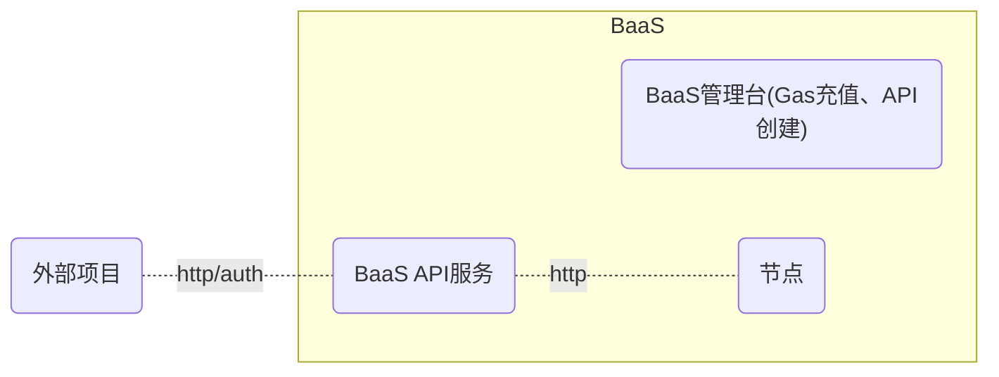

# 外部接入

外部项目方接入的2种方式：直接接入、间接接入。

## 直接接入

### 优劣对比

- 优点：
  - 外部项目方有专业技术团队，追求技术自主可控
  - 自由度高
- 缺点：
  - 需要防止外部项目方对链的攻击
  - token定价和交付

### 接入步骤：
- 通过web3j、web3.js等SDK进行接入
- 提供开放RPC节点给外部项目方
  - 是否需要外部项目方自建（购买）节点服务器？
- 项目方需要购买原生token，来支付上链交易的手续费

几个问题需要思考：

### 外部项目方以何种方式获得原生token？

为了维护链的安全，必须采用经济模型来防止攻击，类似公链的模式。

提出以下方案供参考：

- 根据交易的大小进行定价，对链上gas进行一个定价，项目方购买token用来支付交易的手续费。为了适应国内政策，具体的产品体现形式，可以进行“去币化”，以此来避免政策风险。
  > 例如：可以用“买账户”不同级别的账户中有不同数量的原始token
- 硬件成本模式： 买节点的模式（买RPC节点，不是验证节点）
- “保证金模式” + 买验证节点的模式 + 分红 + 免费上链（有限的token，也要防止攻击）
- 其他模式

## 间接接入（BaaS）

> 参考文昌链的avata: https://apis.avata.bianjie.ai/#section/%E6%96%87%E6%A1%A3%E6%A6%82%E8%BF%B0

### BaaS管理台(C端)

可以参考文昌链的avata，实现基本的功能即可：

| 功能名称 | 说明 |
| -----| ----|
|Gas充值（支付）| 用户充值`RMB`获得链上token作为gas|
|创建项目| 用户创建项目，获取`appid` 和 `apikey`|
|实名认证（个人、企业）| 支持个人、企业的实名认证|

### BaaS API服务的核心功能：
| 功能名称 | 说明 |
| -----| ----|
|创建链账户|链账户是应用平台方或其用户在区块链上的账户地址，用于接受链上数字化资产|
|查询链账户|查询链账户地址、链账户名称、链账户操作记录|
|发行 NFT|NFT 是链上唯一的、可识别的资产，由用户自己在区块链上铸造一个 NFT|
|转让 NFT|用户可以将自己链账户地址上拥有的 NFT 转移给任一奇异链合法链账户地址|
|编辑 NFT|用户可以对自己链账户拥有的 NFT 进行编辑，并更新 NFT 信息至区块链|
|销毁 NFT|用户可以销毁自己链账户地址中拥有的 NFT|
|查询 NFT|根据查询条件，展示平台内的 NFT 以及对应的详情信息|
|查询 NFT操作记录|根据查询条件，展示与应用相关的 NFT 链上操作记录|
|查询上链交易结果|根据 Req ID，查看相关的上链交易结果查询|
|查询上链交易排队状态|查询上链交易排队以及当前交易排队情况|

通过"链服务"进行接入。

### 优劣对比

- 优点：
  - 方便外部项目方接入技术
  - 可以控制流量，防止攻击
  - token售卖可以通过BaaS模式进行
  - 可控
- 缺点：
  - 需要开发独立的链服务，及BaaS平台，以及后期维护，周期长

### 接入步骤：

- 在BaaS注册B端账户，充值Gas
- 根据BaaS平台接口进行对接，

----

# 其他问题

## 验证节点加入

目前我们的验证节点数量是`4`，在`1`个验证节点宕机的情况下，仍然可以正常出块。综合服务器成本和链的稳定性，验证节点数量为`7`是最优的。

当验证节点数量达到7，在2个节点宕机的情况下，仍然可以正常出块。

因为验证节点服务器的成本是持续的，近一两年内平均一年的费用在`3.5`万元人民币左右，因为没有发币，没有区块奖励和质押奖励，因此，要吸引外部节点加入，必须要有链外经济利益驱动。

采用哪种分配方式？

- gas分红？ 是否能够收回成本？

## 免费使用奇异链

让外部项目方可以免费使用奇异链，是否可行？

为了安全考虑，可以收取一定的保证金，比如`10000`元，防止恶意攻击。

## 按年付费？按季度付费？

外部项目方可以采用按年付费，按季度付费的方式。

