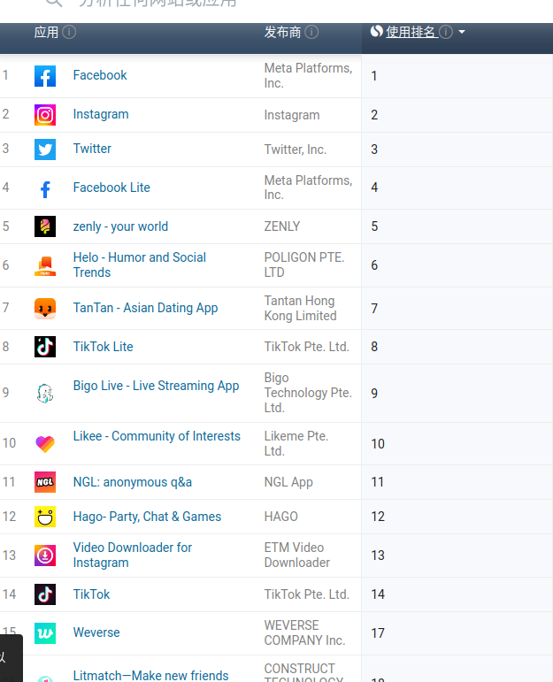
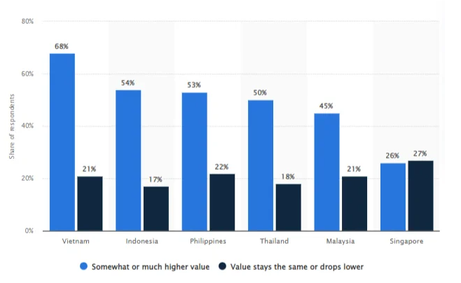
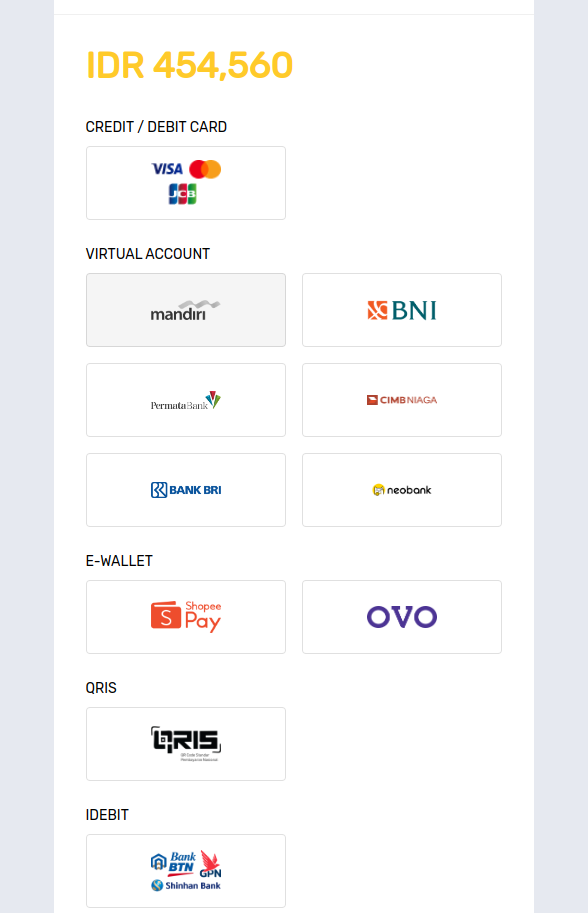

# 印度尼西亚的区块链和NFT市场调研

## 基本介绍

> - 参考： https://zh.wikipedia.org/wiki/%E5%8D%B0%E5%BA%A6%E5%B0%BC%E8%A5%BF%E4%BA%9A
> - 参考： http://cs.mfa.gov.cn/zggmcg/ljmdd/yz_645708/ydnxy_648376/

- 政治制度： 总统制
- 语言文字： 印尼语
- 民族：  爪哇人（40.6%）、巽他人（15%）、马都拉人（3.3%）、米南佳保人（2.7%）
- 宗教： 伊斯兰教(86.70%)、基督新教(7.60%)、天主教(3.12%)
- 货币： 印尼盾
- 人口（2022）：`2.7`亿(世界第4大人口大国)
- 经济：
  - GDP：`1.35`万亿美元(2022)
  - 人均GDP：`~5000`美元(2022)
  - 主要出口产品有石油、天然气、纺织品和成衣、木材、藤制品、手工艺品、鞋、铜、煤、纸浆和纸制品、电器、棕榈油、橡胶等。主要进口产品有机械运输设备、化工产品、汽车及零配件、发电设备、钢铁、塑料及塑料制品、棉花等。
- 首都和经济中心： [雅加达](https://zh.wikipedia.org/zh-tw/%E9%9B%85%E5%8A%A0%E8%BE%BE), 雅加达及周边地区居住人口超过`3000万`，是世界第二大都市圈。
- 历史：
  - 荷兰殖民时期
  - 1950年8月17日 正式成立

## 移动互联网发展情况

- [印尼互联网用户超过1.96亿](https://www.thejakartapost.com/news/2020/11/11/indonesian-internet-users-hit-196-million-still-concentrated-in-java-apjii-survey.html)
- [印尼有将近2亿互联网用户，有1.9亿人是通过手机访问互联网](https://www.forbes.com/sites/forbesbusinesscouncil/2022/07/19/the-indonesian-nft-gold-rush/?sh=270c3fbceb32)
## 社交媒体

- Facebook
- Instagramhttps://www.similarweb.com/zh/apps/top/google/app-index/id/social/top-free/
- Twitter
- TikTok

<!--  -->
<image src=../imgs/indonesia_social_media.png height=600px width=500 >

> 数据来源： https://www.similarweb.com/zh/apps/top/google/app-index/id/social/top-free/

## 大众对区块链的态度

其中蓝色表示： NFT的价值会更高， 黑色表示： NFT的价值会横盘或者更低

## 当地的区块链公司及创业项目

NFT项目：
- https://twitter.com/karafurunft
- https://mobile.twitter.com/mindblowonnft
- https://mobile.twitter.com/superlativess

NFT交易平台：

- 基于BSC的去中心化NFT交易平台： https://www.tokomall.io/
  - 盲盒： https://www.tokomall.io/tokosurprise
  - 数字货币交易所： https://www.tokocrypto.com/

- 基于Near的去中心化NFT交易平台：https://paras.id/zh/market

- 中心化的NFT藏品交易平台（以体育NFT为主, 法币支付）: https://ibl.kolektibel.com/market

    
    <!-- <image src=../imgs/idr_payments.png height=550px width=350 > -->

上图中中的支付方式

借记卡/信用卡支付:
- Visa
- MasterCard
- JCB

虚拟账户？
- Mandiri： 曼迪利銀行
- BNI： 印度尼西亚国家银行，
- Permata Bank： 总部位于雅加达
- CIMB： 聯昌國際銀行， 马来西亚第二大银行
- BANK BRI: 印尼人民銀行
- Neo-Bank: 完全在线银行，没有实体银行（这么牛逼？）

电子钱包

- [Shopee-Pay](https://www.ppro.com/payment-methods/shopeepay/): 电商平台Shopee旗下的支付平台，是东南亚最最受欢迎的电子钱包
- [OVO](https://www.ovo.id/): OVO 是印度尼西亚领先的电子钱包之一，该国近 40% 的消费者使用电子钱包来支付他们在网上购买的商品和服务

QRIS（扫码支付标准）
- [QRIS](https://qris.id/homepage/): 二维码支付？

IDEBIT（快捷支付)
- Shinhan Bank （新韩银行）

## 国家政策法规
- 印尼央行最近强调，加密货币不是一种有效的支付方式
- [在印度尼西亚，被归类为虚拟货币的加密货币在印度尼西亚仍被禁止用作支付工具。](https://siplawfirm.id/cryptocurrency-in-indonesia/)
- [2022-9-20日：印尼收紧加密货币的政策，以确保更多的本地控制](https://www.reuters.com/markets/currencies/indonesia-tighten-rules-crypto-exchanges-ensure-more-local-control-2022-09-20/)
- [在印度尼西亚，加密货币被归类为商品，并由该国贸易部下属的商品期货交易监管机构（Bappebti）监管](https://www.coindesk.com/policy/2022/09/22/indonesia-has-global-plans-for-local-crypto-tokens/)
- [目前，印尼的NFT的监管制度是不确定的。](https://www.ssek.com/blog/non-fungible-tokens-indonesia-regulatory-overview)
- [NFT平台应该最受ESPs（电子系统服务商）相关规定](https://www.ssek.com/blog/non-fungible-tokens-indonesia-regulatory-overview)

