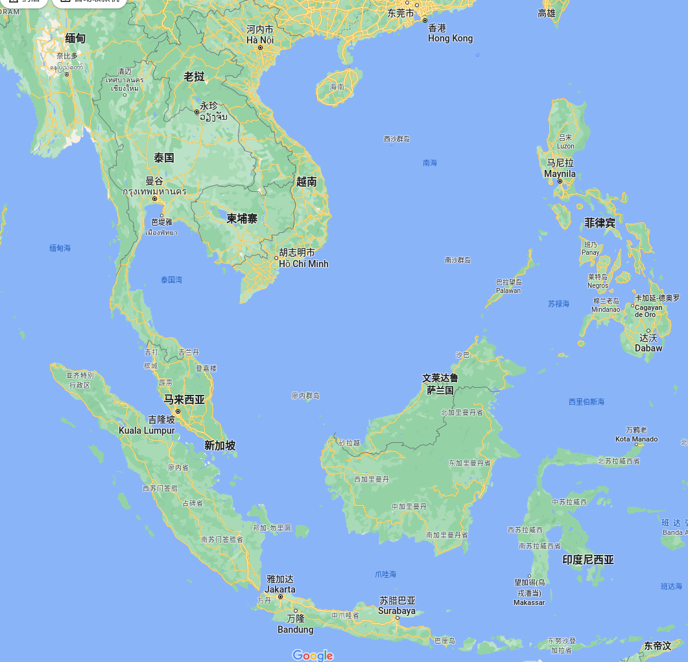
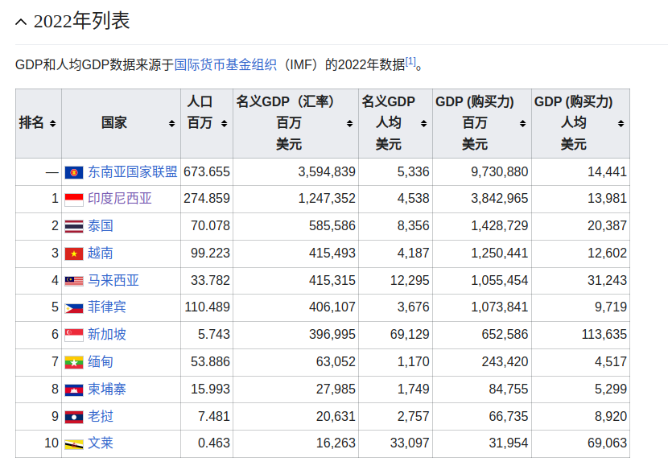
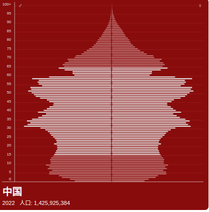
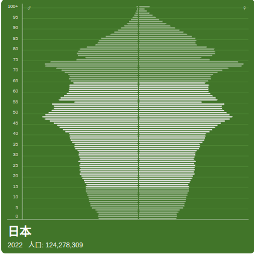
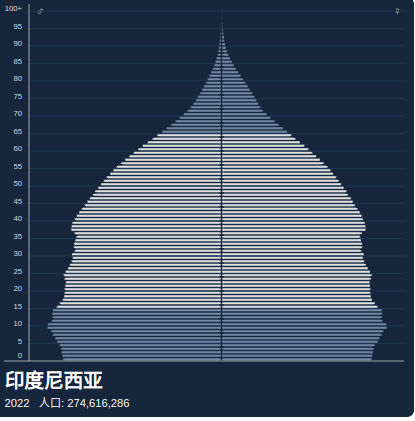
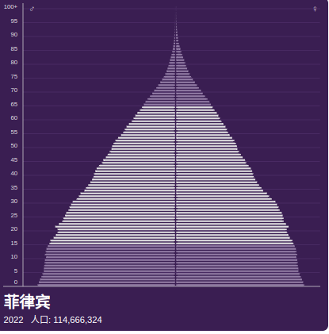
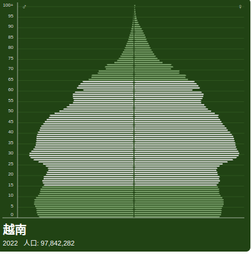
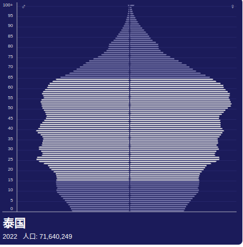
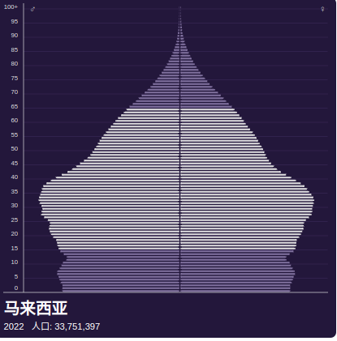

## 东南亚地理

<!--  -->

## 东南亚经济

> https://zh.m.wikipedia.org/zh-hans/%E4%B8%9C%E7%9B%9F%E5%9B%BD%E5%AE%B6GDP%E5%88%97%E8%A1%A8

## 东南亚人口结构

- [东南亚一半以上的人口年龄在 **30** 岁以下](https://www.imf.org/en/Publications/fandd/issues/2018/09/southeast-asian-youth-on-the-future-overman)

> https://population-pyramid.net/zh-cn

## 东南亚数字经济

原文件： [谷歌关于东南亚数字经济的研究报告-2022版.pdf](../files/e_conomy_sea_2022_report_google.pdf)

报告的几个关键点：

- 东南亚主要的6个国家（越南、泰国、马来西亚、新加坡、印尼、菲律宾），总人口超6亿
- 其中**菲律宾**和**越南**在SaaS和Web3领域的增长最快
- 东南亚的“数字10年”才刚刚起步，预计到2025年东南亚的数字经济规模将达到`3000`亿美元，预计到2030年数字经济规模将会超过`6000`亿美元
- 城市中等收入人群中18~29岁的年轻人占比为`11%`, 城市高收入人群整体占比`18%`
- 东南亚的数字经济规模达到`2000`亿美元，比预期提前`3`年
- 数字银行和Web3领域的投资的过去一年增长了`1`倍
- SaaS和Web3是东南亚解决新的挑战的关键所在
- 东南亚的SaaS、软件产业、Web3将在未来3~8年增长80%
- 将Web3嵌入到现有的Web2平台是发展的趋势
- 嵌入金融服务的SaaS解决方案是提升中小企业的数字化和专业化的关键
- VC在Web3领域的投资在持续增加，以下是VC投资领域的占比：
  - 隐私和数字基础设施： 67%
  - DeFi: 57%
  - 区块链游戏： 37%
  - DAOs: 27%
  - 元宇宙： 27%
  - NFTs: 13%
- 远程教育在疫情之后降温，投资者更多的转向SaaS和Web3领域

## 东南亚加密货币和NFT数据汇总

| 国家 | 人口(万) | 年龄中位数 | (2022预计)GDP增长率 |(2022预计)GDP(亿美元) | 人均GDP(美元) |  互联网渗透率 | 加密货币采用率全球排名|  NFT拥有率| 政策|
|-----|------|---------|---------|----|-----|---|----|---|---|
| 印尼 | 27000 | 29.7|5.4%|12470|4500|72.6%|20 |-|禁止用加密货币作为支付工具；对NFT没有明确法律|
| 泰国| 7000 |40.1|3%|5855|8356|77.8%|8 |26.6%|禁止使用加密货币作为支付方式；NFT交易平台满足SEC资质|
| 越南 | 9910 |32.5|8%|4154|4187|73.2%|1 |17.4%|没有明确法律；正在制定监管政策|
| 马来西亚 | 3378|30.3| 5.4%|4153|12298|88.8%| -|23.9%|不明确；加密货币和NFT受法律保护，但不是法定货币，没有明令禁止交易；NFT交易平台需要满足资质|
| 菲律宾 | 11000 |25.9|6.5%|4061|3676|68%| 2|32%|政府明确加密货币用作法定货币;对NFT交易平台没有明确规定|
| 新加坡| 574|42.2|3.5%|3960|69129|92%| -| 6.8%|NFT可被视为财产；对于加密货币和NFT交易平台没有明确规定；|

---

## 杂项

- 越南，超过20%越南人买加密货币
- 菲律宾，国家承认加密货币
- 越南拥抱web3：https://www.f6ex.com/archives/84164.html
- https://meet.bnext.com.tw/articles/view/49354?
  - 東南亞也是全球最年輕、最具活力，最積極擁抱數位應用的地區，人口年齡中位數為30歲
  - 在東南亞近7億人口的大市場中，超過70％的民眾缺乏銀行服務（Underbanked）或無銀行帳號（Unbanked），這樣的條件，為DeFi、加密貨幣投資或資產管理提供了絕佳的發展條件，在提供給大眾的金融服務上，用戶將很輕易跳過傳統銀行直接進入Web3。
  - 在NFT的應用發展上，東南亞也居於領先地位，根據Statista統計，泰國擁有565萬名用戶、越南219萬名、印尼125萬名，分別位居全球第1、5、8名。
- 东南亚web3.0的优势
  - https://accesspath.com/tech/crypto-blockchain/5705430/

- 全球NFT数据： https://www.finder.com/my/nft-statistics

- [东南亚在加密采用率方面领先世界](https://www.coindesk.com/layer2/2022/10/25/chainalysis-report-vietnam-cryptocurrency-adoption/)

- 全球加密采用率排名： https://www.panewslab.com/zh_hk/articledetails/836g9afy.html

