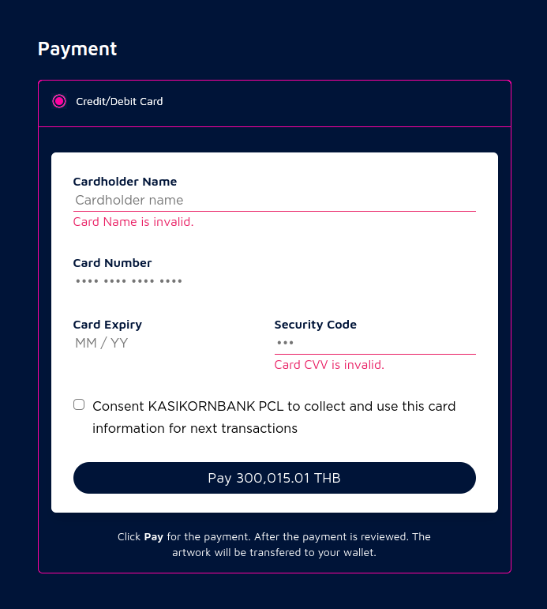

# 泰国的区块链和NFT市场调研

## 基本介绍

> -  参考： https://zh.wikipedia.org/zh-hans/%E6%B3%B0%E5%9B%BD
> - 参考：  https://hktdc.infogram.com/thsc--1h7k2303zo75v2x

- 政治制度： 君主立宪制（议会制）
  - 国王： 玛哈·哇集拉隆功
  - 总理： 巴育·占奥差

- 语言文字： 泰语
- 民族： 86% 暹罗泰族， 3% 高棉人， 2% 马来人， 9% 其他
- 宗教： 93.5% 佛教， 5.4% 伊斯兰教， 1.13% 基督教
- 货币： 泰铢(THB)
- 人口： 6995万（2021）
- 经济：
  - GDP： 5220亿美元（2022估计）
  - 人居GDP： 7448美元
  - 服务占比58.3%， 工业占比33.1，农业占比8.6%
  - 对外贸易占GDP比例： 98%
  - 工业方面[重点发展技术密集型的轻型工业，放弃重工业](http://rdbk1.ynlib.cn:6251/Qw/Paper/62757#anchorList)

- 历史
  - 曼谷王朝的拉玛四世（1851年至1868年在位）开始国家开放政策，借鉴西方国家经验，进行一系列改革以因应对殖民国家施加的压力。他废奴隶制，建设新式交通建设，新式学校与派遣学生留学欧美。
  - 1932年6月，在一次不流血革命后，暹罗成为君主立宪制国家。
  - 二战期间，1941年12月7日, 泰国加入轴心国, 亦成为日本唯一在亚洲的“盟友”
  - 1942年1月25日泰国宣布向英美宣战
  - 1945年8月16日，即日本无条件投降的第二天，暹罗随即宣布“暹罗1942年1月25日对英美宣战宣言无效”
  - 1949年改名泰国
  - 1991年泰国军事政变
  - ......各种政治事件（乱七八糟）
  - 2014年5月20日，泰国军方宣布实施戒严法。泰国陆军总司令巴育宣布接掌政权，巴育与资深军方官员一同在全国转播的节目上，宣布接掌政权，并称此举是为了恢复和平，这是泰国自1932年以来，<u>**军方第12次发动政变**</u>。
  - 2020年2月，泰国宪法法院判处未来前进党解散，引发大规模示威。10月15日，泰国政府宣布进入紧急状态

## 移动互联网发展情况

- 移动互联网用户： 	[5600万，占总人口的`80%`](https://www.statista.com/statistics/558884/number-of-mobile-internet-user-in-thailand/)

## 社交媒体

- Facebook： [5005万用户(2022年)](https://datareportal.com/reports/digital-2022-thailand)
- Facebook Message: 3570万用户
- YouTube: [4280万用户（2022年）](https://datareportal.com/reports/digital-2022-thailand)
- Instagram: 1850万用户
- TikTok: 3580万用户
- Twitter: 1100万
- LinkedIn: 330万用户
- Snapchat: 27.7万用户

## 大众对区块链的态度

- [根据CryptoMonday的分析，泰国拥有565万NFT用户，是全世界最高](https://cryptonews.net/news/nft/8359427/)。巴西499万排名第1，美国381万排名第3。
- [泰国在5个旅游地标和5个路线推出NFT，实现“NFT+旅游”，提出“轻松旅行，免费NFT”的理念](https://travel.trueid.net/detail/xQbLrVoeEx8Y)

## 当地的区块链公司及创业项目

- [coral](https://coralworld.co/): 泰国的NFT交易平台, 以艺术品居多, 藏品在ETH上，使用银行卡支付
    

- [etoro交易所](https://www.etoro.com/en/discover/markets/cryptocurrencies)

## 国家政策法规

- <a href=https://research.hktdc.com/en/article/MTAyNDg1MDk5Nw >泰国证券交易委员会 (SEC) 从 2022 年 4 月 1 日起禁止使用加密货币作为支付方式，理由是出于金融安全方面的考虑。 </a>

- [泰国证券交易委员会禁止在泰国交易 NFT。但是，SEC 并未禁止发行 NFT，这意味着它们仍然可以被购买。](https://www.belaws.com/thailand/legal/blockchain-expertise/nfts-in-thailand/)
- [泰国关于数字资产的法律（2018英文版）](https://www.sec.or.th/EN/Documents/EnforcementIntroduction/digitalasset_decree_2561_EN.pdf)
- [SEC 并未禁止发行 NFT。它只是禁止这些数字资产的交易。原因很可能是数字资产交易所更容易控制。](https://www.ledgerinsights.com/thailand-bans-blockchain-nft-trading-nonfungible-token/)
- [根据数字资产法案，发行NFT需要SEC许可证，并只能在获得SEC许可证的交易所或平台进行交易?](https://www.lawplusltd.com/2022/03/non-fungible-tokens-nfts-under-thai-law/)
