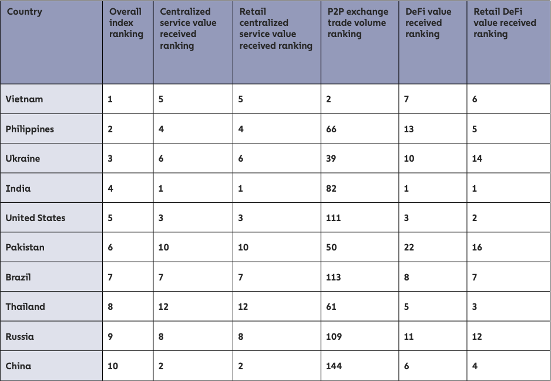
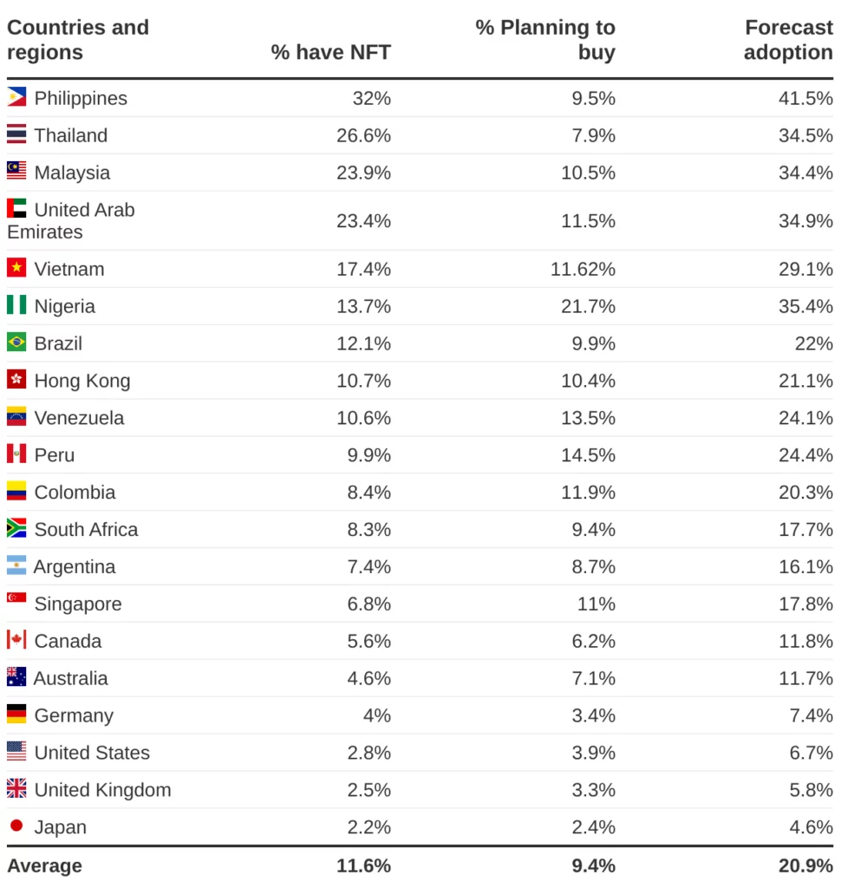

# 菲律宾的区块链和NFT市场调研

## 基本介绍

> 参考： https://zh.wikipedia.org/wiki/%E8%8F%B2%E5%BE%8B%E5%AE%BE

- 政治制度：总统议会制
  - 现任总统： [小费迪南德·马科斯, 是独裁者费迪南德·马科斯之子，人称“小马科斯”](https://zh.wikipedia.org/wiki/%E5%B0%8F%E8%B4%B9%E8%BF%AA%E5%8D%97%E5%BE%B7%C2%B7%E9%A9%AC%E7%A7%91%E6%96%AF)
- 官方语言： 菲律宾语、英语
- 种族：	米沙鄢人（33.8%）、他加禄人（27.7%）、 伊洛克人（9.8%）、华人（1.2%）、其他
- 宗教： 88.7%基督宗教、6.0%伊斯兰教、5.3% 其他/无宗教
- 货币： 菲律宾比索（PHP）
- 人口： `1.12亿`（2022年）
  - [人口年龄中位数：**26岁**](https://zh.zhujiworld.com/ph/)
  - [48%的人口生活在城市, 52%的人口生活在农村](https://data.worldbank.org.cn/indicator/SP.URB.TOTL.IN.ZS?locations=PH)
- 首都： 马尼拉
- 最大城市： [奎松市, 约有300多万人口](https://zh.wikipedia.org/wiki/%E5%A5%8E%E6%9D%BE%E5%B8%82)
- 经济：
  - GDP: `3941亿`美元（2021年）
  - 人均GDP: `3548`美元 (2021年)
  - 至今菲律宾的**政府贪污腐败**问题仍根深柢固，亦冠绝全东南亚，使得全国**三分一人口处于贫穷线下，每日生活费不足一美元。**
  - [菲律賓2021年貧窮率18.1%，近2000萬人陷於貧困](https://www.moneydj.com/kmdj/news/newsviewer.aspx?a=81bab7c1-0da0-4657-8d99-ab2c6a1687a0)
  - 每年约有1,100万的海外劳工将从世界各地打拼所得资产带回菲国，金额高达250亿美元
  - 自从2010年后，政治全面改革，经济逐步改善、外资投资大量注入，
  - 现今菲律宾的产经结构以农业及工业为主，尤其着重于食品加工、纺织成衣以及电子、汽车组件等**轻工业**。
  - 菲律宾主要出口品包括半导体、电子产品、运输设备、成衣、铜制品、石油制品、椰子油及水果。

历史：

- 1450年-1520： 伊斯兰政权殖民
- 1521: 西班牙殖民时期
- 1896: 菲律宾第一共和国
- 美国殖民:
  - 1899年2月, 美国发动美菲战争入侵菲律宾，新生的菲律宾共和国随之瓦解。
  - 1935年3月23日，美国总统富兰克林·德拉诺·罗斯福签署菲律宾宪法草案。1935年11月15日菲律宾国协正式建立
- 1942年－1945年:日本殖民时期
- 1946年7月4日，菲律宾共和国（第三共和）完全独立，但是，美国仍在菲律宾保留军事基地。
- 政治事件：
  - 1965年，费迪南德·马科斯当选总统。
  - 1969年马科斯在被指选举舞弊下成功连任
  - 1981年马科斯结束戒严，但仍然维持独裁统治。
  - 1986年2月25日，科拉松·阿基诺宣布竞选胜利后，费迪南德·马科斯遭**人民力量革命**推翻，
  - 科拉松上台后，虽然仍历经多次军事政变，加上马科斯下台后濒临崩溃的经济，但最终仍完成任期，1992年6月30日卸任，由菲德尔·瓦尔德斯·拉莫斯将军接任。菲律宾**首次和平转移政权，实现政党轮替。**
  - 1998年5月，约瑟夫·艾斯特拉达当选总统
  - 2001年1月20日，约瑟夫·艾斯特拉达因受贿丑闻，而于**第二次人民力量革命**中被迫下台，副总统阿罗约夫人继任。
  - 2004年，阿罗约夫人当选总统，成功连任。
  - 2006年**菲律宾政变**，五千多人示威要求总统阿罗约夫人下台，总统阿罗约夫人其后宣布全国进入紧急状态。
  - 2010年5月10日，科拉松之子贝尼格诺·阿基诺三世击败约瑟夫·埃斯特拉达，成功当选总统。6月30日，阿基诺正式就任总统，任期六年。
  - 2022年6月30日, 独裁者费迪南德·马科斯之子*小费迪南德·马科斯*当选菲律宾总统

## 移动互联网发展情况

- [互联网渗透率为 **68%** (2022)](https://www.truelogic.com.ph/blog/philippine-digital-economy)

## 社交媒体

> https://www.truelogic.com.ph/blog/philippine-digital-economy

- Facebook: `8385万`
- YouTube: `5650万`
- Facebook Messenger:  `5515万`
- Instagram: `1865万`
- TikTok: `3596万`
- LinkedIn: `1100万`
- Twitter: `1050万`

## 区块链和NFT采用率

- [在Finder.com进行的一项调查中，发现 **32%** 的菲律宾人至少拥有一个 NFT。](https://p2enews.com/news/philippines-leads-the-world-in-nft-ownership-the-takedown/)
- [菲律宾金融机构联合银行现在提供加密货币托管和交易服务](https://news.bitcoin.com/philippines-financial-institution-unionbank-now-provides-crypto-custody-and-trading-services/)
- [菲律宾联合银行的金融技术部门最近推出了一个将艺术品作为数字资产的平台，进一步采用了不可替代的代币 (NFT) 交易。](https://business.inquirer.net/368579/unionbank-unit-pushed-nft-trading)
- [菲律宾在全球加密货币采用指数中排名第2](https://www.bworldonline.com/infographics/2022/10/24/482406/philippines-places-2nd-in-the-global-crypto-adoption-index/)

- [东南亚在加密采用率方面领先世界, 菲律宾在加密总排名位居**世界第2**](https://www.coindesk.com/layer2/2022/10/25/chainalysis-report-vietnam-cryptocurrency-adoption/)

- [NFT拥有率占比`32%`， 全世界排名第1](https://p2enews.com/news/philippines-leads-the-world-in-nft-ownership-the-takedown/)

    
## 当地的区块链公司及创业项目

> 菲律宾本地的区块链和NFT相关的公司或平台，实在太少，32%的NFT拥有率是怎么来的？ 用了很长时间才搜集到以下几个：

- Likha，还处于公开测试阶段，基于Polygon的去中心化NFT交易平台，
  - https://beta.likhanft.io/collections

- vention, 菲律宾当地的NFT交易平台， 已经倒闭？ 交易市场打不开了
  - https://vention.app/
- metaversego, 元宇宙游戏: https://app.metaversego.gg/login

- 基于[Bitgert链](https://bitgert.com/) 的NFT交易平台：
  - https://app.youngparrotnft.com/all-nfts

## 国家政策法规

- [菲律宾已允许将加密货币用作**法定货币**。](https://stratsea.com/optimism-tempered-with-reasonable-caution-the-state-of-philippine-cryptocurrency-regulations/)
- [数字银行需要满足相关资质](https://stratsea.com/optimism-tempered-with-reasonable-caution-the-state-of-philippine-cryptocurrency-regulations/)
- [菲律宾中央银行宣布将从下个月开始停止接受加密许可证申请，为期三年。菲律宾中央银行是菲律宾加密行业的主要监管机构。](https://news.bitcoin.com/philippines-will-stop-accepting-crypto-license-applications-for-3-years-regulator-says/)