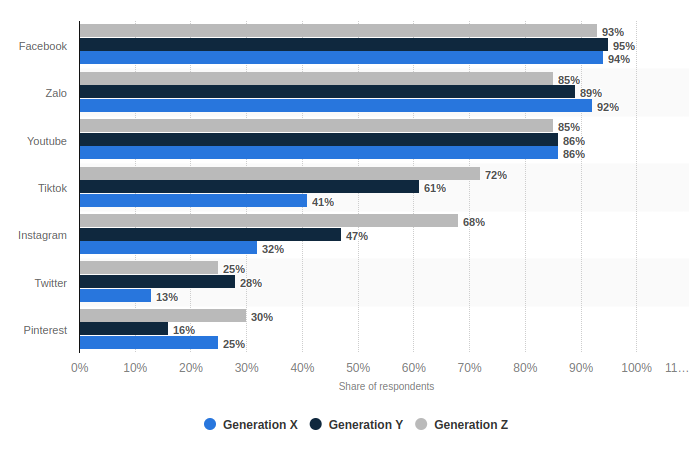

# 越南的区块链和NFT市场调研

## 基本介绍

> https://zh.wikipedia.org/wiki/%E8%B6%8A%E5%8D%97

- 政治制度：一党专政的社会主义国家
- 语言文字： 越南语， 文字以国语字（越南罗马字）为主，汉喃文（汉字）
- 最高领导人: [阮富仲](https://zh.wikipedia.org/wiki/%E9%98%AE%E5%AF%8C%E4%BB%B2)
- 民族：共有54个民族，京族（也称越族）为主要民族，占总人口86.2%，华裔人口约占总人口的1%左右。
- 货币：越南盾
- 人口(2022): 9910万 , 世界排名第15名，
  - 城市人口：`38.05%` (`3765万`)
  - 农村人口：`61.95%` (`6144万`)
- 城市：
  - 胡志明市： `899万`人口
  - 河内(首都): `800万`人口
  - 岘(音同“现”)港: `98万`人口
  - 海防市: `84万`人口
- 经济
  - GDP： 12780亿美元，世界排名35名
  - 人均GDP：4121美元，世界排名121名
  - 全球第二大稻米出口国（第一名是泰国）
  - 电子产品成为越南最大的出口产品，纺织品及服装出口量居全国第二位
  - [世界银行预测，越南2022年的GDP增长率达`8%`](https://cj.sina.com.cn/articles/view/6862376589/199078e8d00102ge7u?finpagefr=p_103)
- 宗教
  - 无宗教（73%）
  - 佛教（14%）
  - 基督教（8%）
- 历史：
  - 1885中法战争以前，越南是中国的藩属国
  - 法国殖民：1885~1945
  - 越南民主共和国： 1945年9月2日
  - 越南分裂（北越、南越）：1954年7月21日
  - 越南战争：1961至1975年
  - 越南统一：1976年7月2日
  - 加入联合国：1977年9月20日
  - 革新开放： 1986
  - 1986年“革新开放”（仿效中国的改革开放）：
  - 2001确立社会主义市场经济
  - 2007加入WTO

## 移动互联网发展情况

> https://datareportal.com/reports/digital-2022-vietnam

- 互联网渗透率： `73.2%`
- 移动互联网渗透率： `72.1%`
- 社交媒体使用率： ` 78.1%`

## 社交媒体

## 民众对区块链和NFT的态度

- [越南的NFT总用户数在世界排名第5名](https://vir.com.vn/vietnam-among-countries-with-the-most-nft-users-94102.html), 前实名分别是：泰国(565万）、巴西（499万）、美国（381万）、中国（268万）、越南（219万）、印度（150万）、加拿大（140万）、印度尼西亚（125万）、德国（123万）、南非（123万）
- [根据Finder's在线调查，调查了28723名成年人，其中越南受访者中有17.4%的人持有NFT](https://www.cekindo.vn/blog/a-comprehensive-overview-of-the-nft-sector-in-vietnam)。菲律宾（32%）、泰国（26.6%）、马来西亚（23.9%）、阿联酋（23.4%）、越南（17.%）、尼日利亚（13.7%）、巴西（12.1%）
- 超过`68%`的受访者表示未来5年NFT的价值会提高

    截止2021年，东南亚6国民众对于未来5年内NFT价值预期：

    

    其中蓝色表示： NFT的价值会更高， 黑色表示： NFT的价值会横盘或者更低

> 图片来源： https://www.statista.com/statistics/1292111/sea-nft-value-expectations-by-country/

## 当地的区块链公司及创业项目

- 公链(NFT方向)：
  - Aura, 基于Cosmos生态的公链，主打NFT领域
  - https://aura.network/
  - https://github.com/aura-nw
  - https://twitter.com/AuraNetworkHQ

- NFT游戏， ASPO World, 基于BSC的的战略思维游戏，游戏中有NFT交易：
  - https://aspo.world/
  - https://twitter.com/AspoWorld

- NFT游戏，Poriverse， 类似ASPO World，也是NFT Play-toEarn模式的区块链游戏，
  - https://linktr.ee/poriverse

## 国家政策法规

- [目前越南**几乎没有**NFT相关的法律法规，因此NFT交易不受法律保护](https://www.viettonkinconsulting.com/general/vietnam-nft-market-potential-investment-opportunity/)

- [越南政府**正在制定**加密货币监管法律政策](https://www.vietnam-briefing.com/news/vietnam-tasks-government-agencies-prepare-legal-framework-cryptocurrencies-virtual-assets.html/)

- [越南目前尚**未有明确**法律对加密货币进行监管](https://ykvn-law.com/how-to-classify-and-regulate-crypto-in-vietnam/)

## 其他

- [根据机构预测，到2026年，越南的区块链相关行业产值将会达到25亿美元，相比现在翻5倍。](https://www.viettonkinconsulting.com/general/vietnam-nft-market-potential-investment-opportunity/)

---

## 延伸阅读：

- [越南學者：從電子工業的沉浮看「越南製造」的痛處](https://www.hk01.com/%E4%B8%96%E7%95%8C%E5%B0%88%E9%A1%8C/797876/%E8%B6%8A%E5%8D%97%E5%AD%B8%E8%80%85-%E5%BE%9E%E9%9B%BB%E5%AD%90%E5%B7%A5%E6%A5%AD%E7%9A%84%E6%B2%89%E6%B5%AE%E7%9C%8B-%E8%B6%8A%E5%8D%97%E8%A3%BD%E9%80%A0-%E7%9A%84%E7%97%9B%E8%99%95)
  - 在電子工業中，跨國企業很少向國內供應商轉讓技術，國內企業一直停留在價值鏈的低端環節。
  - 而越南電子行業則用了20年時間（1996-2016）。二十年後，越南的電子工業仍遠未進入改進階段。
  - 政府為跨國企業提供了有利的待遇，卻沒有迫使其擔負讓國內企業參與全球價值鏈的責任。
  - 由於投資許可權的下放，越南中央政府對地方的決策幾乎沒有發言權。權力下放導致各省之間相互爭奪外國直接投資，從而削弱地方政府對跨國公司履行其義務的監督。因此，越南電子工業的發展並沒有達到預期的效果，政策的制定背景和執行過程限制了該行業的發展。
  - 在支持工業發展和融入全球生產網絡方面，越南政府缺乏實質性的政策支持框架，公共和私營部門在決策制定與執行過程中缺乏合作。
  - 政府制定了對外國公司的直接租金，並附加了一些條件，但沒有明確的執行機制來監督外國投資者的履行情況。
  - 政府所提供的激勵措施是不對稱的，外國公司得到了許多激勵措施，而本土中小企業卻沒有得到相應的待遇。
  - 為了向全球企業供貨，本土企業要滿足較高標準，這需要更多的資本和熟練勞動力。與此同時，當地私營企業由於規模小，在吸引資本投資和熟練勞動力方面難以與外國企業或國有企業競爭。沒有政府的支持，他們很難做到這一點。
  - 該行業現在仍由外國企業主導，而國內企業的技術發展有限
  - 外國直接投資不會自動提升東道國的技術能力，在缺乏必要的政策框架來約束外資部門的情況下，對外國技術和良好制度的開放，不足以促進經濟轉型和持續增長。政府需要將關注點從對贏家（部門、行業、企業和其他組織）的一次性選擇轉移到對選擇的錯誤進行檢測和糾錯上。解決方案是，通過各種公私合作，設計出一個可以發現和糾正錯誤的機制。
  - 泰國和馬來西亞在加入WTO時，從2000年代初開始便被要求禁止正式使用當地成分要求（LCR），但它們巧妙地間接引入了LCR。馬來西亞政府利用稅收優惠政策鼓勵跨國公司投資培訓國內企業員工。這些公司可以進行新的投資，以升級其培訓設備或擴大其培訓能力，因為提供技術和職業培訓的公司有資格獲得10年100%的投資稅減免。
  - 市場和貿易自由化改革本身並沒有為越南電子工業的國內企業帶來預期的技術升級

- [印度、越南和墨西哥　哪國在真正挑戰中國世界工廠地位？](https://www.hk01.com/%E4%B8%AD%E5%9C%8B%E8%A7%80%E5%AF%9F/830662/%E5%8D%B0%E5%BA%A6-%E8%B6%8A%E5%8D%97%E5%92%8C%E5%A2%A8%E8%A5%BF%E5%93%A5-%E5%93%AA%E5%9C%8B%E5%9C%A8%E7%9C%9F%E6%AD%A3%E6%8C%91%E6%88%B0%E4%B8%AD%E5%9C%8B%E4%B8%96%E7%95%8C%E5%B7%A5%E5%BB%A0%E5%9C%B0%E4%BD%8D)
  - 越南人口不到1亿，经济体量有限
  - 经济发展的腹地比较狭小，制约其发展空间
  - 越南工業部門不齊，偏向於輕工業為主，缺乏重化工業能力
  - 越南严重缺乏本土的世界级企业。截止2021年，越南没有自己的世界500强，而印度有7家、中国有143家。這意味著越南在面臨外資企業湧入的同時，缺乏承接外來企業的外部溢出能力。在此情況下，外資企業的大量湧入，反而可能抑制越南本土企業的成長。
  - 而且實際上在越南承接的FDI當中，有相當部分是來自中國內地，這也意味著越南與中國供應鏈的相互依存關係實際上是加強了
  - 中國對越南的大額出口、巨大順差本身也說明越南更像是中美之間的一個重要緩沖地帶，而不是替代中國世界工廠的角色。
  - 未來越南更有可能形成外資企業主導格局。
