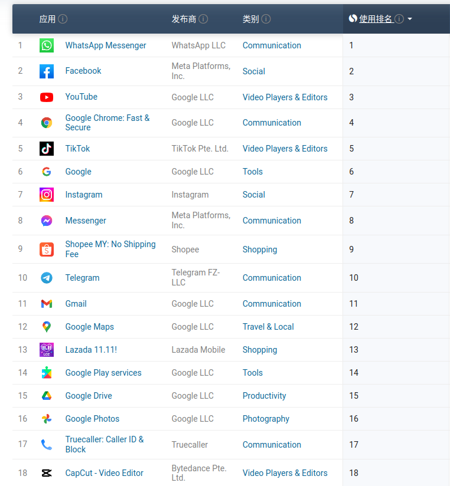

# 马来西亚的区块链和NFT市场调研

## 基本介绍

> 参考： https://zh.wikipedia.org/wiki/%E9%A9%AC%E6%9D%A5%E8%A5%BF%E4%BA%9A

- 政治制度：联邦议会制
- 语言文字： 马来语
- 民族： 69.4%原住民（土著），23.2%华裔, 6.7%印度裔, 8.3%非公民
- 宗教： 61.3% 伊斯兰教, 19.8% 佛教, 9.2% 基督教,  6.2% 印度教
- 货币： 马来西亚林吉特(MYR)
- 人口： 3298万
  -  马来西亚 `78.2%` 的人口居住在城市，而 `21.8%` 的人口居住在农村地区。
  - [马来西亚人口的中位年龄为 31.0岁。](https://datareportal.com/reports/digital-2022-malaysia)
- 经济：
  - GDP: `4,393`亿美元(2022)
  - 人均GDP： `13,268`美元(2022) ， 超过中国人均GDP`12500`美元
  - 马来西亚是亚洲基础建设较发达的国家之一。在通信基础设施建设，政府投入较大，4G覆盖率达到94.7%；在2021年12月开始建设5G，预计2024年覆盖全国80%人口
  - 在世界网速排名榜上升至全球排名第28名
  - 马来西亚具有七座国际港口, 境内共有118座机场
  - 马来西亚的能源生产主要依靠煤炭、石油与天然气。马来西亚的天然气储量只剩下33年，石油储量只剩下19年。发电量方面，16%来自水力发电，其余84%来自火力发电
  - 华人占有马来西亚`70%`的市场资本
  - 由于劳力密集产业的兴起，全国估计有300多万外籍劳工，约占国家人口的10%, 300万当中有200万人是非法移民

- 教育
  - 马来西亚政府提供的小学与中学教育皆免费（公立学校）
  - 马来西亚非常注重国民教育，六年强制性小学教育，以及五年强制性的中学教育。根据马来西亚法律，如家长不让子女接受六年强制性小学教育，可能会被教育部以虐待儿童罪名提告
  - 小学和中学都分别有中文和马来语教学的学校
- 历史
  - 1511年葡萄牙殖民
  - 1824英国殖民
  - 1957年8月31马来亚联合邦宣布独立，东古·阿卜杜勒·拉赫曼就成为马来西亚（当时称为马来亚）的国父，同年担任第一任总理。
  - 1965年8月9日，马来西亚国会全数通过，**将新加坡驱逐出马来西亚，新加坡被迫独立。**
  - 1969年5月13日“五一三冲突”，马来人（巫来由人、巫裔）与华人之间的种族冲突，原因是在当时的各族间政治及经济能力有很大的差异；**马来人针对华人所展开的屠杀行为**。这次血腥的种族冲突导致了多人死亡和负伤；在华人占多数的地区，华人死伤人数远高于马来人。
  - 1998年，亚洲金融危机使马来西亚的经济和政局严重受挫
  - 1999年，经济增长率就接近危机前的水平
  - 2020年2月21日起至2022年10月10日，**马来西亚政治危机**，马来西亚执政党希望联盟政府与后继的国民联盟政府所发生的执政危机[1]导致出现政权轮替。2022年10月10日，总理伊斯迈尔沙必里宣布正式解散第14届国会下议院，以举行全国大选。因此，该危机已在当天结束。

- 种族矛盾
  - 种族因素在马来西亚政治扮演重要角色。政府所推行的新经济政策与1990年取代前者的国家发展政策，用以加强马来西亚土著的地位。这些政策提供各种优惠待遇给马来人，包括就机会、教育、奖学金、商业经营，以及以优惠价格购买住宅。虽然这些政策改进马来人的经济地位，但却招来部分人的不满，认为这使华人和印度人成为二等公民。

## 移动互联网发展情况

- [2022年马来西亚互联网渗透率: **88.8%**](https://www.statista.com/statistics/975058/internet-penetration-rate-in-malaysia/)
- [移动互联网的渗透率：**88.4%** ](https://www.statista.com/statistics/975011/malaysia-mobile-phone-internet-user-penetration/)
- [截止2022年1月，马来西亚有 **2955万** 互联网用户。](https://datareportal.com/reports/digital-2022-malaysia)

- [App排行榜](https://www.similarweb.com/zh/apps/top/google/store-rank/my/all/top-free/)

    

    - Lazada: 东南亚电商平台，阿里巴巴收购了
    - Shopee: 电商平台, 总部新加坡（新加坡华人李小东创建）
    - Messenger(Facebook Messenger): Facebook推出的社交软件

## 社交媒体

- 马来西亚有 `3025万`社交媒体用户, 占总人口的`91.7%`
- WhatsApp
- Facebook用户： `2170万`
- Facebook Messenger用户: `1215万`
- Youtube用户： `2360万`
- Instagram用户:  `1555`
- TikTok用户: `1459万`
- LinkedIn用户: ` 630万 `
- Snapchat用户: `135万`
- Twitter用户: `440万`

## NFT市场

- [马来西亚NFT用户数`75.5万`](https://www.finder.com/my/nft-statistics)

## 当地的区块链公司及创业项目

**NFT交易平台**：

> 参考： https://vulcanpost.com/781698/nft-marketplaces-malaysia-list-features-artists-gas-fees/

- Pentas.io, 马来西亚最知名的NFT交易平台, 基于BSC的去中心化NFT交易平台:
  -  https://www.pentas.io/

- 基于`BSC`的去中心化NFT交易平台(类似OpenSea）， https://nft.my/

- NFT Pangolin, 基于以太坊和[ZTX](https://www.zepetox.io/about)的去中心化NFT交易平台
- NFTapir， 基于Polygon和ETH的去中心化NFT交易平台，以绘画艺术品NFT为主，以`USDT`稳定币进行交易，可以防止币价波动影响NFT的价格
  - https://nftapir.com/gallery

**NFT项目**：

> 参考： https://www.24local.com.my/nft-malaysia/

- 基于Polygon的NFT项目，Langkah Sheraton是一幅代表马来西亚政治重要时刻的大型油画。 https://www.langkahsheraton.com/

- 基于老虎主题的NFT项目（应该是华裔搞的）：
  - https://tiger.pestlemortarclothing.com/
  - https://opensea.io/collection/thetigerarchivesnft

- Punks Malaysia: 仿Crypto Punk的像素风格PFP项目
  - https://punks.my/
  - https://opensea.io/collection/punks-malaysia

- 8sian 是以 `8888` 位美丽的亚洲女性精心打造的 NFT，即使是最复杂的细节也充满了历史意义:
  - https://8sian.io/
  - https://opensea.io/collection/8sian-main-collection

## 国家政策法规

- [加密货币和NFT资产受法律保护](https://hakocapital.com/2022/04/18/cryptocurrency-nft-legal-in-malaysia/)
- [如果您在马来西亚经营 NFT 市场，这也意味着您需要注意 SC 实施的所有数字资产法规。马来西亚 NFT 平台的运营商应谨慎行事，在运营平台之前与马来西亚证券委员会接触。](https://hakocapital.com/2022/04/18/cryptocurrency-nft-legal-in-malaysia/)
- [加密货币不是法定货币，政府对加密比较谨慎，对加密货币和NFT和NFT交易，没有明确的法律条文。](https://www.mondaq.com/fin-tech/1248146/crypto-law-in-malaysia)
- [不是法定货币，但没有明文法律禁止加密货币的交易、支付](https://www.richardweechambers.com/5-legal-issues-about-cryptocurrency-in-malaysia-youll-want-to-know-about/)
- [马来西亚已经有加密货币支付网关，如 Coinbase Commerce、Bitpay 和 Cryptobilis，它们接受加密货币作为支付方式。](https://www.richardweechambers.com/5-legal-issues-about-cryptocurrency-in-malaysia-youll-want-to-know-about/)
- [加密货币需要交税](https://www.richardweechambers.com/5-legal-issues-about-cryptocurrency-in-malaysia-youll-want-to-know-about/)
- [交易加密货币是合法的, 但是需要在DAX进行注册， 否则会面临罚款](https://www.richardweechambers.com/5-legal-issues-about-cryptocurrency-in-malaysia-youll-want-to-know-about/)
