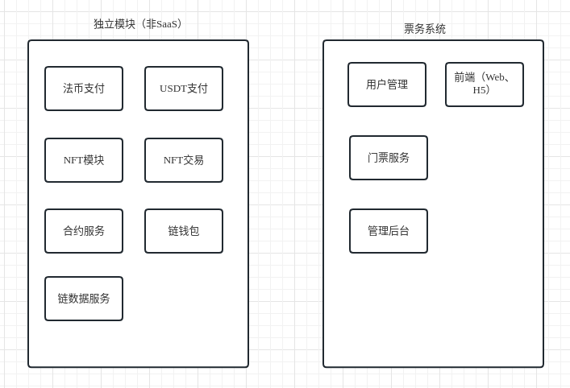
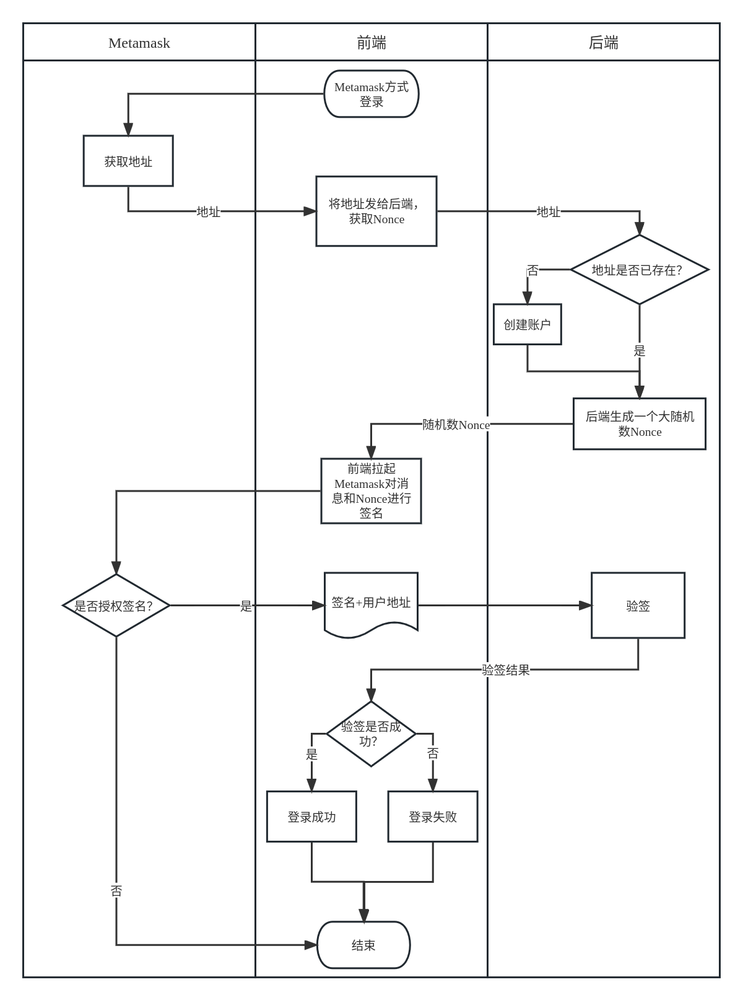
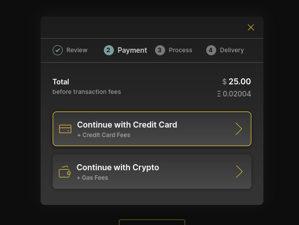
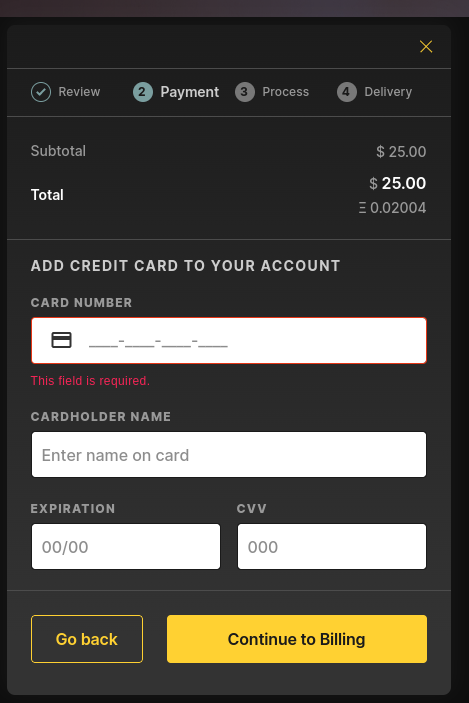
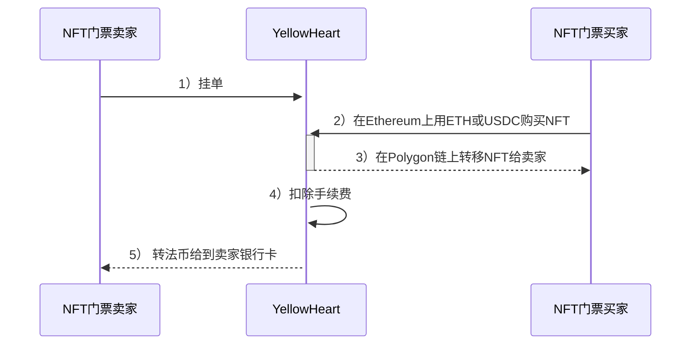
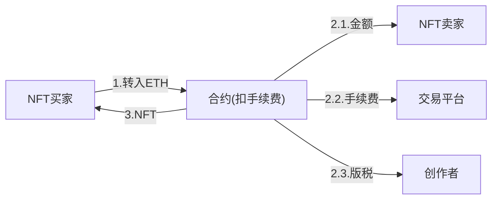

> 关联文档： [14.海外版NFTSaaS.md](../14.海外版NFTSaaS.md)

# 技术预研

## 做什么？

- 传统：Web2部分——演唱会门票网站
  - 功能：
    - 门票网站的必要功能
    - Web端、H5端
  - 对标网站：
    - 国内： [摩天轮](https://www.moretickets.com/)
    - 国外：
      - [ticketmelon](https://www.ticketmelon.com/)
- 创新：Web3部分——NFT交易平台
  - 功能：
    - 融合"NFT+门票"
    - 支持NFT二手交易
    - USDT支付
    - 支持数藏玩法
    - 能上OpenSea
  - 对标：
      - Yellow Heart: https://yh.io/

## 市面同类产品

- YellowHeart:
  - 官网：https://yh.io/
  - [yellowheart白皮书](yellowheart-protocol-whitepaper.pdf)
- https://nftconcerts.com/

## 几个思考
- 中心化和去中心化？
- 如果用合约实现多种玩法，成本问题如何解决？

## 功能模块（粗略）

## 技术细节研究

### Metamask登录

> 参考： https://zh.socialgekon.com/one-click-login-with-blockchain

后端需要在用户表中增加`address`和`nonce`字段。兼容其他登录方式，如邮件、facebook登录

| 字段 | 类型 | 说明|
|-----|-----|-----|
| address | varchar(42)| 账户地址, 唯一, 例如：`0xf513e4e5Ded9B510780D016c482fC158209DE9AA`|
| nonce| varchar(100) | 随机数，每次登录都随机生成,且不会重复， 例如签名消息：`1_0xf513e4e5ded9b510780d016c482fc158209de9aa_29933_1672989603538`|

### 账户模型

参考yellowheart, 用户以邮件作为主要登录方式,绑定Metamask账户，Metamask用作ETH或USDC支付

### 支付方式

参考yellowheart, 支持信用卡、ETH两种支付方式:

虽然NFT是在Polygon发行，但是，其中ETH使用Metamask账户的ETH余额进行支付。

信用卡支付：

yellowheart的ETH支付（分账）流程:

ETH和USDC收款合约地址： https://etherscan.io/address/0x53c663cdb68689089f3fea3e586a7e4552b72e52

没有找到分账交易，yellowheart应该是直接收取ETH或USDC，然后从自己的法币账户转账给用户（卖家），同时扣除手续费。

用加密货币（ETH、USDC）购买NFT的流程：

平台接收ETH、USDC，需要承担币价波动的风险。

### 一级市场

一级市场只支持法币支付？

### 二级市场(法币)分账逻辑

按照传统的方式分账即可。

### 二级市场(加密货币)分账逻辑

> 支持加密货币支付，是否在当地的合法合规？

从上面的yellowheart的分账逻辑来看，yellowheart存在一定的问题。

初步的构想，我们可以参考opensea的分账模式，即用合约进行（加密货币）支付的分账。

ETH分账逻辑：

https://etherscan.io/tx/0x3670c917df8160b8a63a5f88d006d88d41cb7c2f9d29b2b47df43fdefa031b7b

使用的Wyvern老协议

ERC20代币的分账逻辑：

https://cn.etherscan.com/tx/0x7e01bde0407a054d3a2b0be5b5c5b7d843cc880a2a171699c9ad253385a9f60a

可以参考的分账合约实现：

- https://cn.etherscan.com/address/0x59728544b08ab483533076417fbbb2fd0b17ce3a#code
- https://cn.etherscan.com/address/0x9b2a5804d0b835851c78dfeabdccd517568dd9a2#code

opensea的seaport协议关于分账的合约实现代码：

https://github.com/ProjectOpenSea/seaport/blob/main/contracts/lib/TokenTransferrer.sol

基本流程：

- 卖家用户调用`setApprovalForAll`允许平台转移账户的当前NFT合约所有资产，并且挂单
- 买家买入，调用合约，并向合约发送ETH或WETH，购买NFT
- 平台合约自动执行分账，如：手续费扣除、版税扣除、转账给卖家
- 平台合约将NFT转入买家账户
- 完成交易

### 钱包功能

- Ethereum
  - ETH
  - USDC
  - HRTS： yellowheart发行的币
- Polygon
  - WETH

### 二级市场

用户可以将自己的NFT门票挂单卖出，可以设置版税。同OpenSea

### 门票

- 如何生成？
- 如何兑换？
- 实物？
- 如何核销？

### 法币支付

TODO, 2c2p对接
