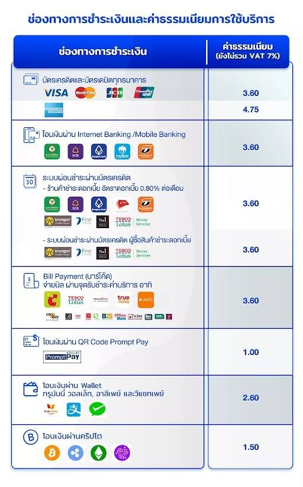
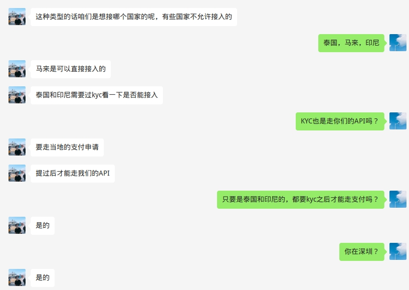

<!--
 * @Author: yqq
 * @Email: youngqqcn@gmail.com
 * @Date: 2023-01-09 10:39:41
 * @Description: file content
-->

# 关于结算货币的问题

用不同的货币结算，这个影响蛮大的。要看支付渠道是否支持外汇结算，这个一般要有牌照，然后结算周期和汇损也是双方要协商的。

用当地货币结算，可以避免不必要的损失。

# 东南亚支付网关

> https://mp.weixin.qq.com/s/20QY44MW9tSBobeiyUeHNA

## 某四方支付

- 费率

    

1000印尼盾 = 0.4人民币

优势：
  - 提供T+0结算

劣势：
  - 费率**太高**
  - 支付方式太少，不支持国际信用卡（Visa、MasterCard、AMEX、JCB）

## 2c2p

- 简介： 2C2P由缅甸企业家Aung Kyaw Moe于2003年创立，总部位于新加坡和泰国。它们还在与国际化金融机构如美国运通、中国银联、万事达以及Visa卡合作。
- 官网： https://2c2p.com/
- 详细介绍： 
- 费率：

    

## xendit

- 简介： Xendit是一家**印度尼西亚**金融科技公司，在印度尼西亚、菲律宾和东南亚地区提供领先的支付解决方案，支持信用卡和借记卡、电子钱包、银行转账以及更多渠道。
- 官网： https://www.xendit.co/zh/
- 详细介绍文档： [Xendit_印尼菲律賓_支付解決方案_22Q4.pdf](../files/Xendit_印尼菲律賓_支付解決方案_22Q4)

- 费率:

    

- 优势：
  - 支持印尼当地几乎所有的支付方式
  - 费率相对合理
- 要求和说明：
  - 对于其他国家地区的支付方式支持不够，仅支持国际信用卡
  - 印尼当地的很多支付方式，对于国外主体有很多限制，不能使用
  - 需要印尼本地主体

    

## Siampay(Asiapay子公司)

- 简介： Siampay是Asiapay在泰国的全资子公司。Asiapay（连款通）成立于2000年，总部在香港。
- 官网： https://www.siampay.com/en/
- 费率：
- 对于NFT的态度： 可以做
- 要求:
  - 最好是泰国当地的主体

## ipay88

- 简介： 马来西亚第一大支付网关
- 官网： https://www.ipay88.com/

## molpay(现在的: Razer Merchant Service)

- 简介： 东南亚排名前3的三方支付公司，是马来西亚第1家第三方支付服务公司。被雷蛇收购后，支付服务改名为`Razer Merchant Service`
- 官网： https://merchant.razer.com/v3/

- 对web3的态度：

- 对公司实体的要求：
  - 需要有背书： 这一点对于他们很重要，我们与马来西亚当地的iMe公司合作，我们负责技术，iMe负责项目运营，只需要提供给他们**我们和iMe的合作合同**，这样，对于他们来说，风险就会相对降低很多。
  - 最好是用马来西亚的实体对接他们的支付业务，可以避免很多问题，如：信用卡支付的问题

> 个人观点:
> - razer和其他支付公司一样，对与web3相关的业务比较谨慎。他们主要担心我们像交易所那样卷款跑路。还有政策风险。
> - Xendit和Razer都是东南亚排名前三的三方支付平台，虽然他们都觉得web3有风险，但是，他们也知道我们这个业务资金流水很大，利润空间很大。只要风险可控，他们还是愿意和我们对接的，细节方面都是可以谈的。

## doku

- 简介： 印尼的支付网关
- 官网： https://www.doku.com/en-US

## ~~OceanPay钱海支付~~

**不支持NFT业务的接入**

- ~~简介： Oceanpayment/钱海成立于2014年5月。总部设在**香港**，并在深圳、澳洲、美国、欧洲、新加坡设有技术&运营中心或业务主体；主要提供B2C(B)模式的一站式跨境支付解决方案和服务。支持VISA、MasterCard、UnionPay International、American Express、FirstData、WeChat Pay、Alipay、Klarna等支付。~~
- ~~官网： https://www.oceanpayment.com/cn/~~
- ~~详细文档： [Oceanpayment简介中文版202209-V5.0-MAD.pdf](../files/Oceanpayment简介中文版202209-V5.0-MAD.pdf)~~

## Pay Solutions

- 简介： 泰国的一家支付公司，成立于2013年，提供多种支付方式，包括加密货币支付
- 官网： https://paysolutions.asia/
- 费率：

    

## GoAllPay

（国人做的）

- 简介： AllPay成立于2015年，是专注于跨境支付处理和服务的聚合支付服务平台，AllPay与花旗银行、上海银行，浦发银行以及银联，支付宝，微信支付，Visa，万事达卡，Paypal等合作，提供全
球数十种支付工具
- 详细文档: [GoAllPay跨境全球支付方案更新版202212.pdf](../files/GoAllPay跨境全球支付方案更新版202212.pdf)

- 协议文件： [202212AllPay跨境支付协议.docx](../files/202212AllPay跨境支付协议.docx)

- 费率

  

## 德恒国际（四方支付）

（国人做的）

能接NFT业务，但是费率高得离谱

- [解决方案文档.pdf](../files/Doit-presetetion_CN_202206.pdf)

- 费率

  

## Payssion

（国人做的）

- NFT

    

    

- 费率表：
  

- 不支持国际信用卡支付， `T+15`结算周期

## PayPal

新加坡的公司营业执照需要关联新加坡地区的PayPal账户。

PayPal费率： https://www.paypal.com/id/webapps/mpp/merchant-fees

费率表比较复杂，把关键信息提炼一下：

| 国家 | (收款)费率 | 付款费率| 提款费率|
|-----|-----------| --- | ---|
| 马来西亚 | 3.9% + 2 MYR | | |
| 泰国|  3.4% + 11 THB | |
| 印尼| 3.4% + ? | | |

## adyen

- 官网： https://www.adyen.com/
- 费率： https://www.adyen.com/pricing

## worldpay

- 简介： 全球性支付平台
- 官网： https://www.worldpay.com

----

# 泰国支付

PromptPay是泰国主流的支付方式，其次是Truemoney

## 2c2p
[同上](#2c2p)

## Omise(opn)

## SiamPay

[同上](#Siampay)

## iPay88
## CodaPay

- https://www.codapayments.com/market-guide/thailand

- 7%的电子服务税
-

## Pay Solutions (Formerly Thaiepay)