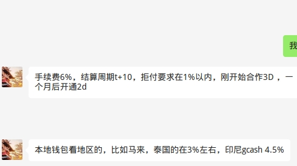

<!--
 * @Author: yqq
 * @Email: youngqqcn@gmail.com
 * @Date: 2023-01-09 10:39:41
 * @Description: file content
-->

## 某四方支付

- 费率

    

1000印尼盾 = 0.4人民币

优势：
  - 提供T+0结算

劣势：
  - 费率**太高**
  - 支付方式太少，不支持国际信用卡（Visa、MasterCard、AMEX、JCB）

## 2c2p

- 简介： 2C2P由缅甸企业家Aung Kyaw Moe于2003年创立，总部位于新加坡和泰国。它们还在与国际化金融机构如美国运通、中国银联、万事达以及Visa卡合作。
- 官网： https://2c2p.com/

- 费率：

    

## xendit

- 简介： Xendit是一家**印度尼西亚**金融科技公司，在印度尼西亚、菲律宾和东南亚地区提供领先的支付解决方案，支持信用卡和借记卡、电子钱包、银行转账以及更多渠道。
- 官网： https://www.xendit.co/zh/
- 详细介绍文档： [Xendit_印尼菲律賓_支付解決方案_22Q4.pdf](../files/Xendit_印尼菲律賓_支付解決方案_22Q4)

- 费率:

    

- 优势：
  - 支持印尼当地几乎所有的支付方式
  - 费率一般
- 劣势：
  - 对于其他国家地区的支付方式支持不够，仅支持国际信用卡
  - 印尼当地的很多支付方式，对于国外主体有很多限制，不能使用
  - 需要印尼本地主体

    

## ~~OceanPay钱海支付~~

**不支持NFT业务的接入**

- ~~简介： Oceanpayment/钱海成立于2014年5月。总部设在**香港**，并在深圳、澳洲、美国、欧洲、新加坡设有技术&运营中心或业务主体；主要提供B2C(B)模式的一站式跨境支付解决方案和服务。支持VISA、MasterCard、UnionPay International、American Express、FirstData、WeChat Pay、Alipay、Klarna等支付。~~
- ~~官网： https://www.oceanpayment.com/cn/~~
- ~~详细文档： [Oceanpayment简介中文版202209-V5.0-MAD.pdf](../files/Oceanpayment简介中文版202209-V5.0-MAD.pdf)~~

## GoAllPay

（国人做的）

- 简介： AllPay成立于2015年，是专注于跨境支付处理和服务的聚合支付服务平台，AllPay与花旗银行、上海银行，浦发银行以及银联，支付宝，微信支付，Visa，万事达卡，Paypal等合作，提供全
球数十种支付工具
- 详细文档: [GoAllPay跨境全球支付方案更新版202212.pdf](../files/GoAllPay跨境全球支付方案更新版202212.pdf)

- 协议文件： [202212AllPay跨境支付协议.docx](../files/202212AllPay跨境支付协议.docx)

- 费率

  

## 德恒国际（四方支付）

（国人做的）

能接NFT业务，但是费率高得离谱

- [解决方案文档.pdf](../files/Doit-presetetion_CN_202206.pdf)

- 费率

  

## Payssion

（国人做的）

- NFT

    

    

- 费率表：
  

- 不支持国际信用卡支付， `T+15`结算周期

## PayPal

新加坡的公司营业执照需要关联新加坡地区的PayPal账户。

PayPal费率： https://www.paypal.com/id/webapps/mpp/merchant-fees

费率表比较复杂，把关键信息提炼一下：

| 国家 | (收款)费率 | 付款费率| 提款费率|
|-----|-----------| --- | ---|
| 马来西亚 | 3.9% + 2 MYR | | |
| 泰国|  3.4% + 11 THB | |
| 印尼| 3.4% + ? | | |
