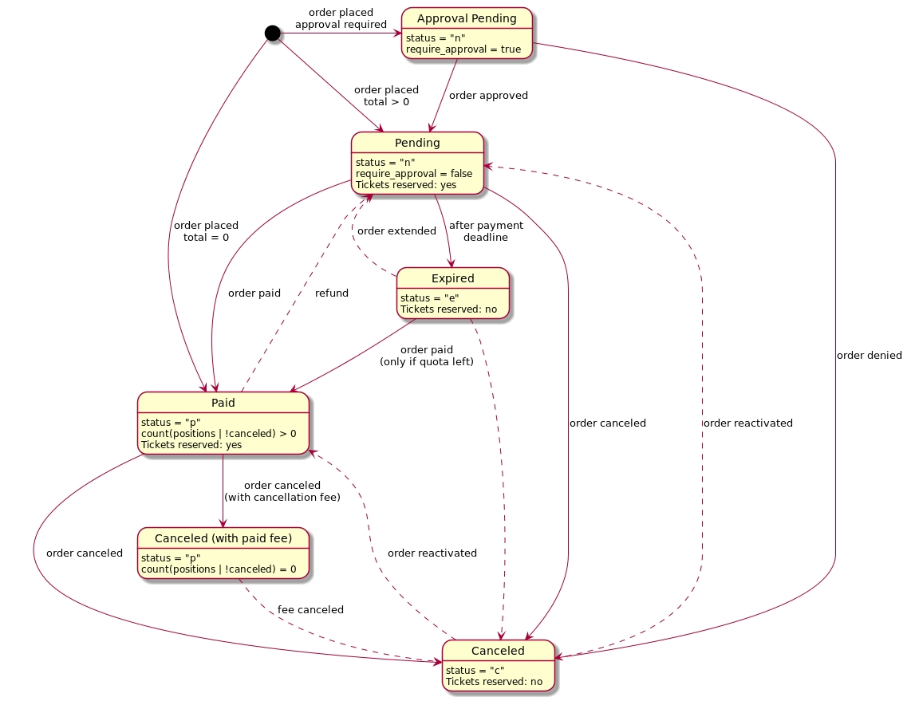

<!--
 * @Author: yqq
 * @Email: youngqqcn@gmail.com
 * @Date: 2023-01-11 09:45:01
 * @Description: file content票务
-->

# 票务系统

票务系统设计: https://www.woshipm.com/pd/3651828.html

## 几个概念

- event: 事件, 某时发生在某地的某件事
- organizer: 组织, 抽象出来的运行事件的实体
- user: 用户，所有能够登录管理后台管理事件的人
- items: 产品， 即门票
- variations: 每个items可以不同款式
- quotas: 定额，item可以被卖出的次数
- voucher： 代金券， 可以有优惠

## 订单状态图

- Approval Pending
- Pending 处理中
- Expired 过期
- Paid 已支付
- Caceled(with paid fee) 已取消（含手续费）
- Caceled 已取消

## 核销

- 扫码核销： https://github.com/pretix/pretixscan-android
- 通过APP扫码核销

## 问题

NFT门票是在线的图片，二维码显示在图片中，如何防止不被盗用?

