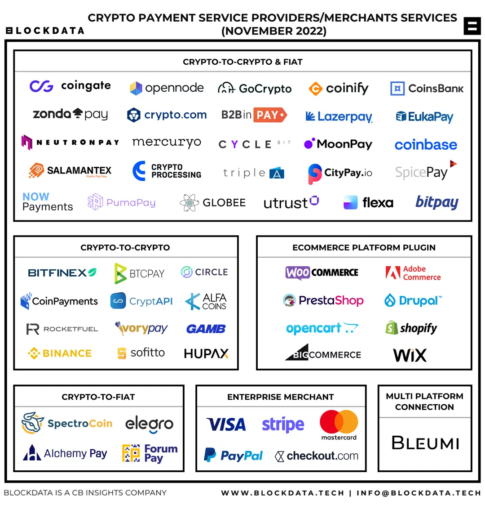

<!--
 * @Author: yqq
 * @Email: youngqqcn@gmail.com
 * @Date: 2023-01-30 11:05:13
 * @Description: file content
-->

# 加密货币支付

- 加密货币
    - TRC20-USDT支付： https://github.com/qiyichain/epusdt

    - 使用ethplorer的监控API，实现入账监控，减少自己实现的复杂度： https://docs.ethplorer.io/monitor?from=apiDocs#section/Introduction

        

    - https://coingate.com/
    - https://bitpay.com/
    - https://www.opennode.com/

  - 加密货币支付平台
    - 为什么不自己做？ 不重复造轮子，市面上早已有成熟的解决方案，比自己做更节省时间，提高效率。
    - TRC20-USDT支付： https://doc.tronapi.com/
    - https://blog.mugglepay.com/#/README-CN

---

## tronapi

费率： 2.5%

https://doc.tronapi.com/faq/#%E5%A6%82%E4%BD%95%E6%94%B6%E8%B4%B9

效果：

## sopay

抽水
- 微信：3%
- USDT：3%

效果：

