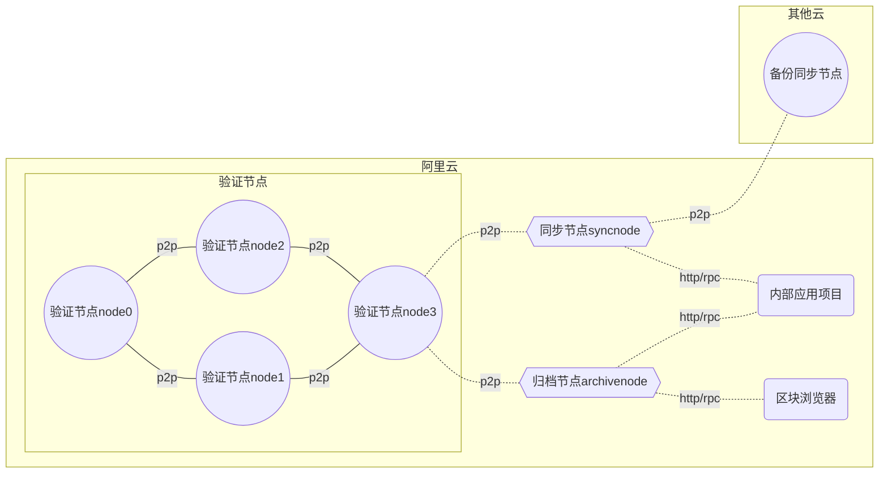

# 奇异链主网(mainnet)节点部署步骤

重要的事情说三遍：
- ❗特别注意：不要使用`ansible`进行批量操作！
- ❗特别注意：不要使用`ansible`进行批量操作！
- ❗特别注意：不要使用`ansible`进行批量操作！


## 节点关系图

节点类型定义：

- 验证节点(node0 ~ node3)：参与共识和链治理，不对外
- 同步节点(syncnode)：数据量等于验证节点，不参与共识和链治理，直接对外提供RPC服务
- 归档节点(archivenode)：拥有全量历史数据，数据量大于验证节点和同步节点，不参与共识。区块浏览器需要用到此节点



- ❗注意: 上图中节点间通信使用p2p通信，节点会互相连接并进行通信

- 所有节点默认p2p端口(TCP/UDP): `32668`
- 归档节点和同步节点的默认RPC端口(TCP):
  - http: `8545`
  - websocket：`8546`


## 环境(node0服务器, 其他节点不需要)


- 系统：Linux/MacOS
- 工具：`yum install make automake jq sshpass -y` 或 `sudo apt install make automake sshpass jq -y`
- Python3: `yum install python3` 或 `sudo apt install python3 -y`
- 下载peculiar最新的发布的版本可执行文件，解压，将`geth`加到`/usr/bin/`目录：https://github.com/qiyichain/peculiar/releases
- 检查geth是否能执行：`geth --help`
- 下载`bootnode`, 将`bootnode`加入`/usr/bin/`目录
- 在node0在`/etc/ssh/ssh_config`加入`StrictHostKeyChecking no`，防止后续执行脚本进行`scp`时需要确认公钥

## 监控数据库

- 需要某台服务器(如：区块浏览器服务器)上安装，InfluxDB, 配置用户名和密码，并创建数据库：`node0`、`node1`, `node2`, `node3`, `archivenode`, `syncnode`

## 关键参数

- chainId: `2285`
- 初始账户:
  - 账户1：`0x9dEaa276B25863D5Df573fD00f364b64B72Ef0Ab`（同时作为系统合约的admin）
  - 账户2：`0x9dbb1224029B56dADABF78B794147840099eD4b2` （备份账户）
  - 账户3：`0x6dC0EB347060FC84d98A3c3F31c7Ba8E2EAc6584` （备份账户）

- 节点数量：
  - 验证节点：4
  - 同步节点：1
  - 归档节点：1


## 生成脚本的配置说明

gen-script-config.json，需根据实际情况修改以下配置：

```js
{
    "node0_ip": "172.16.100.101",  // node0的ip（内网ip）
    "node1_ip": "172.16.100.102",
    "node2_ip": "172.16.100.103",
    "node3_ip": "172.16.100.104",
    "syncnode_ip": "172.16.100.105", // 同步节点（内网ip）
    "archivenode_ip": "172.16.100.106",  // 归档节点（内网ip）
    "influxdb_ip":"172.16.100.105", // influxdb 数据库ip
    "influxdb_port":"8086",
    "influxdb_username":"influxdb",
    "influxdb_password":"password"
}
```


## 步骤

所有的步骤都使用`make`进行操作, 请确保已经安装`make`

### 1.清空历史数据

- `make clean`

### 2.初始化

- `make init`


### 3.生成`shell`脚本

- `make gen`


### 4.拷贝数据到其他节点服务器

> 需要在环境变量设置节点的密码 , `export NODEPASS=xxxxxx`，其中`xxxxxx`需要替换节点`ssh`密码

- `make copy`


### 5.启动引导节点（仅第一次启动需要，链正常出块之后，就不需要了）

> 特别注意：我们默认在node0上启动引导程序。如果不是，需要修改其他脚本文件

- `make start-bootnode`


### 6.进入各个节点的 `/data/nodeX`获取`/data/syncnode`或`/data/archivenode`目录

- 启动： `./start.sh`
- 查看日志：`tail -f ./logs/chain.log`


如果各个节点区块高度一直在增加，说明一切正常。
