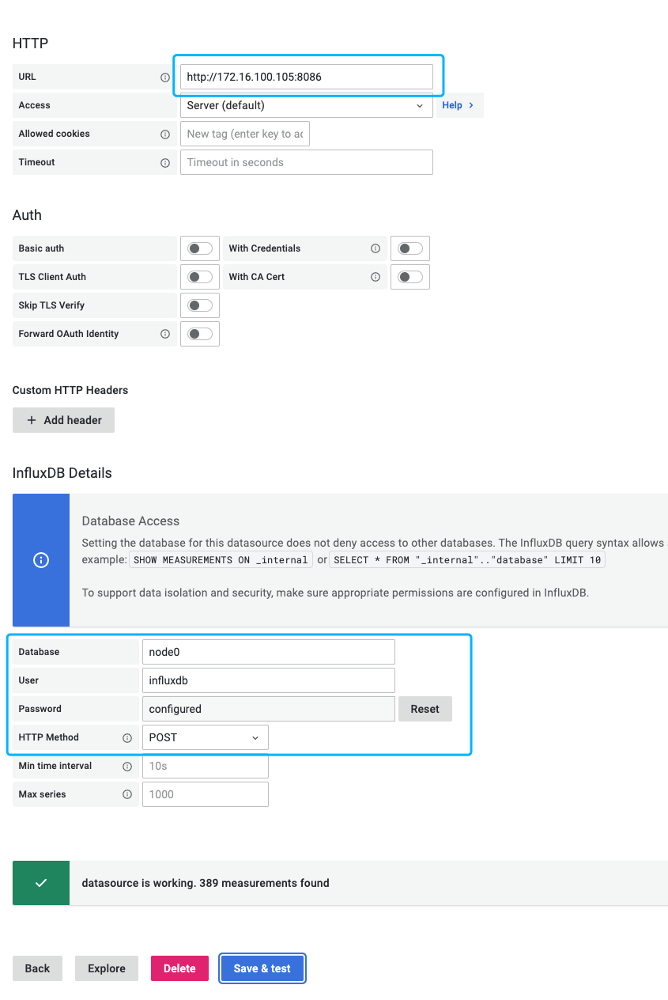
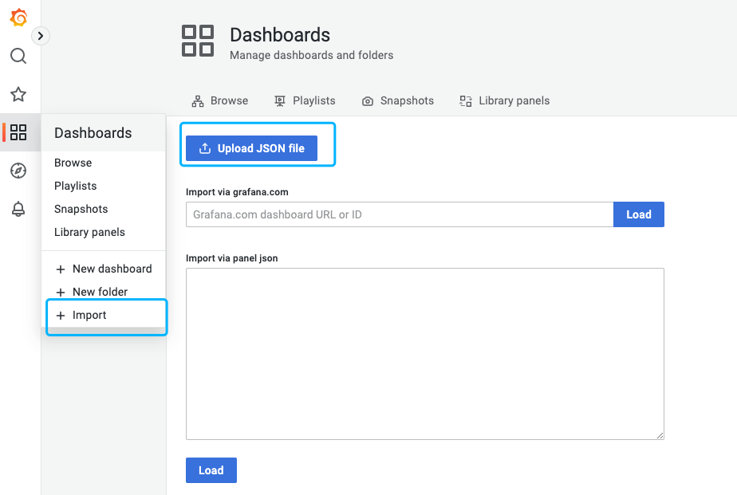
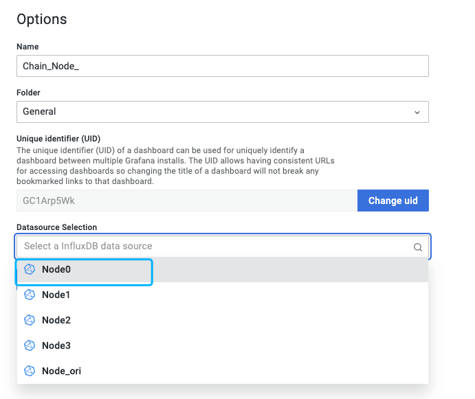

### 监控相关

* 数据库
* 图表展示
* 节点启动
* 可能出现的问题

---

#### 数据库

数据库采用现有节点支持的存储：`Influxdb`

1. 安装

* 部署环境使用[Docker](https://www.docker.com/)
* Influxdb使用`1.8`版本，[官方仓库](https://hub.docker.com/_/influxdb/tags)（基于2.x版本的监控输出功能暂未测试）
* `1.8`版本仓库下载：`docker pull influxdb:1.8`

2. 部署

```bash
# 创建配置文件夹
mkdir -p /data/influxdb/config

# 创建数据文件夹，数据持久化到本地文件夹
mkdir -p /data/influxdb/data

# 创建 influxdb 容器默认配置文件
sudo docker run --rm influxdb:1.8 influxd config | sudo tee /data/influxdb/config/influxdb.conf > /dev/null

# 修改默认配置
  # 开启http权限（节点写入数据）⚠️
  [http]
  enabled = true
  bind-address = ":8086"
  auth-enabled = true

# 启动 docker 容器，指定数据post接收端口，默认：8086
docker run -d \
 --name=influxdb \
 --hostname=influxdb \
 -p 8086:8086 \
 -v /data/influxdb/data:/var/lib/influxdb \
 -v /data/influxdb/config:/etc/influxdb \
 -v /etc/localtime:/etc/localtime \
 -e TZ=Asia/Shanghai \
 --restart unless-stopped \
 influxdb:1.8
 
# 启动容器后，进入 docker 容器配置用户（如果有其他办法可以自行参考）
docker exec -it influxdb bash
# 进入 Influxdb 配置命令行
>> influx
>> CREATE USER <username> WITH PASSWORD '<password>' WITH ALL PRIVILEGES
# 参考：用户名密码（节点存数据需要填写）⚠️
<username>:  influxdb
<password>:  password

# 创建数据库（节点提交监控数据用），通常为了避免数据覆盖，需要分别给共识节点创建独立的数据库⚠️ 
# Grafana 监控也需要配置多个数据源（DataSource）
# 给节点 0 添加数据库
>> creata database node0 
# 给节点 1 添加数据库
>> creata database node1
# 给节点 2 添加数据库
>> creata database node2
# 给节点 3 添加数据库
>> creata database node3

# 退出
>> exit
```

3. 可能出现的部署问题

* influxdb文件夹权限
* 创建管理员账户 [文档](https://archive.docs.influxdata.com/influxdb/v0.13/administration/authentication_and_authorization/#create-a-new-admin-user)
* 创建非管理员账户 [文档](https://archive.docs.influxdata.com/influxdb/v0.13/administration/authentication_and_authorization/#create-a-new-non-admin-user)
* 参考认证和授权 [中文文档](https://jasper-zhang1.gitbooks.io/influxdb/content/Query_language/authentication_and_authorization.html)

---

#### 图表展示

**图表展示采用`Grafana`**

1. 安装

```bash
# 暂无特定版本需求
docker pull grafana/grafana
```

2. 部署

```bash
# 创建配置文件夹
mkdir -p /data/grafana/config

# 创建数据文件夹，数据持久化到本地文件夹
mkdir -p /data/grafana/data

# grafana 初始配置文件，docker容器启动前，需要放入/data/grafana/config ⚠️
wget -P /data/grafana/config https://github.com/qiyichain/dev-docs/blob/master/monit/grafana.ini 

# 启动容器，默认端口：3000
docker run -d \
  --name=grafana \
  -p=3000:3000 \
  -v=/data/grafana/config:/etc/grafana \
  -v=/data/grafana/data:/var/lib/grafana \
  -e="GF_SECURITY_ADMIN_PASSWORD=password" \
  --user=$ID \
  --restart=unless-stopped \
  grafana/grafana:latest
  
# ⬆️ <GF_SECURITY_ADMIN_PASSWORD> 配置项，是修改默认密码，默认账户名密码：admin  admin

```

3. 添加数据源

```bash
# 登陆 Grafana 网页端
# 配置 DataSource （Influxdb 数据源）
http://<IP>:3000/datasources/new

# 主要配置参数：
* Name: ...
* URL: Influxdb 访问IP、端口，（如果获取不到数据，可以尝试填入 ip）
* Database：node0，或是 node1 ...
* User: influxdb
* Password: password
```




4. 添加节点监控配置，json文件

```bash
# 导入 Dashboard json文件
# 下载路径：
https://github.com/qiyichain/dev-docs/blob/master/monit/node_dashboard.json

# 添加 Dashboard，见下图
```





5. 其他问题
* 添加数据源参考[官方文档](https://grafana.com/docs/grafana/latest/datasources/influxdb/)
* 导入导出 Dashboard 参考官方[配置文档](https://grafana.com/docs/grafana/latest/dashboards/export-import/)

---

#### 节点启动

1. 一些说明
* 节点监控数据有 3 种导出方式
  * Prometheus
  * Influxdb Ver1.x
  * Influxdb Ver2.x


* 目前采用 `Influxdb Ver1.x`
* 节点监控数据导出时间：`3 秒`（可以修改，但要节点重新编译，如果确需要新增配置，可以提需求。）

2. 节点启动需要配置

```bash
# 在节点启动脚本后添加，参考配置
--metrics \
--metrics.influxdb \
--metrics.influxdb.endpoint="http://<Influxdb IP>:<Influxdb Port>" \
--metrics.influxdb.database="node0" \
--metrics.influxdb.username=influxdb \
--metrics.influxdb.password=password \

# ⚠️
# metrics.influxdb.database 
## 每个节点的配置不一样，此处配置与两个地方的配置相关
### 1. Influxdb 创建数据库  create database node0 ...
### 2. Grafana 添加数据源时候的配置

# metrics.influxdb.username
# metrics.influxdb.password
## 自行配置，但要与 Inflxudb 的创建的用户名密码一致
```

---

#### 可能出现的问题

1. 阿里云 Docker IP 问题

*    阿里云服务器的内网 IP 与 Docker 默认 IP 段冲突，引发外部无法访问 Docker 容器环境下的` Grafana、Influxdb 端口`，尝试两个办法：
     *    修改 Docker 默认 IP
     *    通过 Nginx 转发
