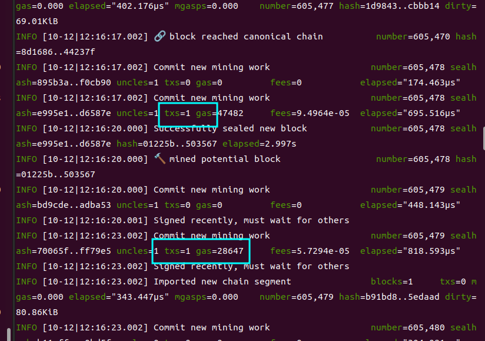

# 链恢复

## 是什么？

    在遇到极端情况下，如何恢复链的正常运行？

## 为什么需要研究这个？ 什么情况下需要用到？

- 云服务商因素：因为设计到数字藏品和区块链业务，假如有一天，阿里云把我们的节点服务器封了，导致奇异链停止。这样就会影响到奇异链上的业务层，会带来很多问题。

- 链本身的因素：链上出现共识错误、分叉、或者其他验证bug，导致链停止出块。

## 怎么操作？

必要条件：

- 有一个备份的同步节点
- 有所有验证节点的私钥文件和私钥密码文件
- 创世文件：`genesis.json`

操作步骤：

- 将验证节点的私钥文件和`genesis.json`拷贝到不同服务器上
- 使用`geth --datadir=./nodes/nodeX/data init ./genesis.json` 命令初始化数据目录
- 将不同验证节点的私钥文件`keystore目录`和`password.txt`拷贝到`data`目录下
- 启动node0节点，bootnode连接到`备份同步节点`
- 等待node0节点区块同步完成
- 关闭node0
- 重复前面3步动作，将node1、node2、node3的区块同步下来
- `逐个逐个`启动node0、node1、node2、node3
- 观察4个验证节点的出块情况

### 测试截图

> 2022-10-12以测试链进行测试，成功通过一个同步节点，恢复整条链的运行。

node0拉取区块完成:

node1拉取区块完成:

node2拉取区块完成:

node3拉取区块完成:

逐个启动4个验证节点, 4个验证节点和1个同步节点，恢复正常出块：

提交几笔复杂的智能合约部署交易，一切正常：

---

2022-10-12 15：20 by yqq

(end)